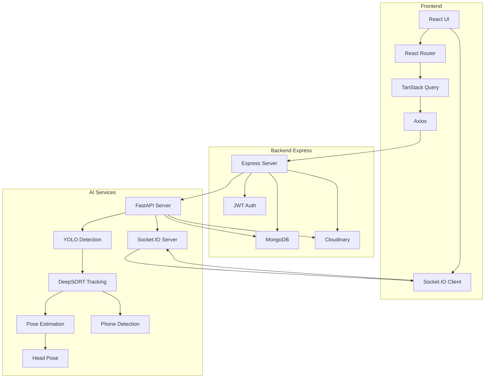

# NeuroProctor

An AI-powered exam integrity platform that detects cheating behaviors in recorded exam videos using computer vision and machine learning.

## Overview

NeuroProctor is a comprehensive proctoring system that uses advanced AI models to analyze exam recordings and detect potential cheating behaviors such as phone usage, looking away, and multiple people in frame.

## Technology Stack

### Frontend
- **React 19** - UI framework
- **Vite** - Build tool
- **React Router 7** - Routing
- **TanStack Query** - State management
- **Socket.IO Client** - Real-time communication
- **Axios** - HTTP client
- **TailwindCSS** - Styling

### Backend (Express)
- **Express 5** - Web framework
- **MongoDB (Mongoose)** - Database
- **JWT** - Authentication
- **Cloudinary** - Cloud storage
- **Multer** - File uploads

### AI Services
- **FastAPI** - Web framework
- **YOLOv8** - Object detection
- **DeepSORT** - Person tracking
- **YOLO Pose** - Pose estimation
- **6DRepNet** - Head pose estimation
- **InsightFace** - Face embeddings
- **Socket.IO** - Real-time events

## System Architecture



## Current Implementation Status

### Working Components
- ✅ User authentication (register, login, logout)
- ✅ Role-based access control (admin, invigilator)
- ✅ Exam creation and management
- ✅ Exam session creation
- ✅ Student face enrollment with multi-pose embeddings
- ✅ Video upload and processing
- ✅ AI pipeline (YOLO detection, DeepSORT tracking, pose estimation, head pose, phone detection)
- ✅ Real-time Socket.IO logging during video processing
- ✅ Cloudinary integration for images and videos
- ✅ MongoDB persistence

### Incomplete Features
- ❌ Face identification during video processing
- ❌ Cheating rule engine
- ❌ Suspicion scoring
- ❌ Report generation
- ❌ Evidence capture and storage
- ❌ Real-time exam monitoring (live mode)

## Documentation

Comprehensive documentation is available in the [docs](docs) folder:

- [System Architecture](docs/02%20-%20System%20Architecture.md) - High-level system design
- [API Reference](docs/08%20-%20API%20Reference.md) - All API endpoints
- [Database Reference](docs/09%20-%20Database%20Reference.md) - Database models
- [Setup Guide](docs/06%20-%20Setup%20and%20Running%20Guide.md) - How to set up and run
- [AI Services Overview](docs/AI%20SERVICES/AI%20Services%20Overview.md) - AI pipeline details

## Quick Start

### Prerequisites
- Node.js 18+
- Python 3.10+
- MongoDB
- Cloudinary account

### Installation

1. Clone the repository:
```bash
git clone https://github.com/hamza9021/NeuroProctor-AI-based-Exam-Cheating-and-Impersonation-Detection.git
```

2. Set up the Backend (Express):
```bash
cd Backend(Express)
npm install
cp .env.example .env
# Configure .env with your values
npm run dev
```

3. Set up the Frontend:
```bash
cd Frontend
npm install
cp .env.example .env
# Configure .env with your values
npm run dev
```

4. Set up AI Services:
```bash
cd "AI SERVICES"
python -m venv venv
source venv/bin/activate  # On Windows: venv\Scripts\activate
pip install -r requirements.txt
cp .env.example .env
# Configure .env with your values
python main.py
```

For detailed setup instructions, see the [Setup and Running Guide](docs/06%20-%20Setup%20and%20Running%20Guide.md).

## Project Structure

```
NeuroProctor-AI-based-Exam-Cheating-and-Impersonation-Detection/
├── Frontend/                 # React frontend application
├── Backend(Express)/         # Express backend API
├── AI SERVICES/              # FastAPI AI processing service
├── docs/                     # Comprehensive documentation
└── README.md                 # This file
```

## Contributing

Contributions are welcome! Please read the [Development Roadmap](docs/14%20-%20Development%20Roadmap.md) for recommended priorities.

## License

This project is licensed under the MIT License.

## Contact

- GitHub: https://github.com/hamza9021/NeuroProctor-AI-based-Exam-Cheating-and-Impersonation-Detection
