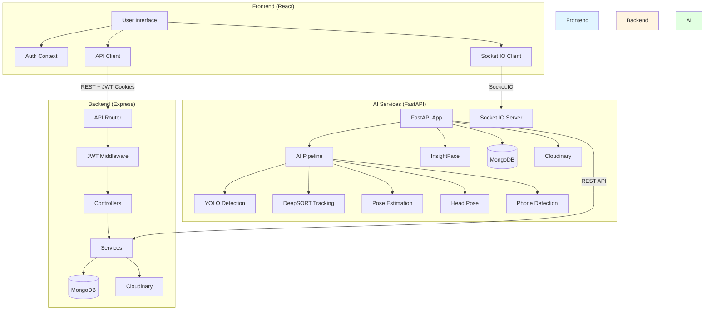
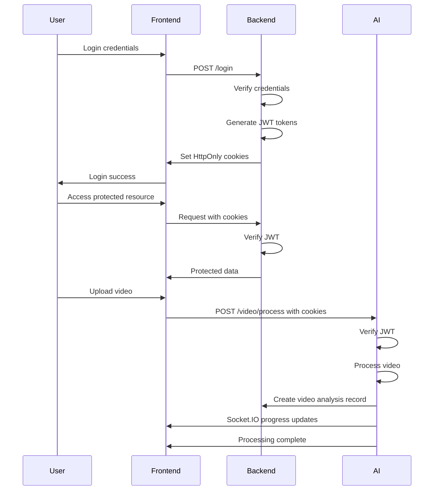

# System Architecture

## High-Level Overview

NeuroProctor is a distributed system consisting of three main applications that communicate via REST APIs and Socket.IO:

1. **Frontend** - React-based user interface
2. **Backend (Express)** - Node.js business logic and data persistence
3. **AI Services** - FastAPI AI processing server

## Architecture Diagram



## Frontend Architecture

### Technology Stack
- **Framework:** React 19 with Vite
- **Routing:** React Router 7
- **State Management:** React Context + TanStack Query
- **HTTP Client:** Axios
- **Real-time:** Socket.IO Client
- **Styling:** TailwindCSS
- **Forms:** React Hook Form

### Component Structure
```
src/
├── App.jsx                    # Main app with routing
├── main.jsx                   # Entry point
├── contexts/
│   └── AuthContext.jsx        # Authentication state
├── Pages/
│   ├── Auth/
│   │   ├── Login.jsx
│   │   └── Register.jsx
│   ├── Dashboard/
│   │   ├── AdminDashboard.jsx
│   │   ├── InvigilatorDashboard.jsx
│   │   └── InvigilatorSessions.jsx
│   └── Homepage.jsx
├── components/
│   ├── Admin/
│   ├── ExamSessions/
│   ├── Exams/
│   ├── Layout/
│   ├── Students/
│   ├── VideoUpload/
│   └── ui/
├── apis/                      # API clients
├── AxiosInstance/             # Axios configuration
└── utils/                     # Utility functions
```

### Key Patterns
- **Protected Routes:** Route guards for role-based access
- **API Composition:** Centralized API clients per domain
- **Error Handling:** Global error boundaries
- **Loading States:** React Query for async state

## Backend (Express) Architecture

### Technology Stack
- **Framework:** Express 5
- **Database:** MongoDB with Mongoose
- **Authentication:** JWT (access + refresh tokens)
- **File Upload:** Multer
- **Cloud Storage:** Cloudinary
- **Validation:** Joi

### Layer Architecture
```
src/
├── index.js                   # Entry point
├── app.js                     # Express app configuration
├── Config/
│   └── db.js                  # MongoDB connection
├── Controllers/               # Request handlers
│   ├── user.controller.js
│   ├── exam.controller.js
│   ├── examSession.controller.js
│   └── videoAnalysis.controller.js
├── Models/                   # Mongoose schemas
│   ├── user.models.js
│   ├── exam.models.js
│   ├── examSession.models.js
│   └── videoAnalysis.models.js
├── Routes/                   # Route definitions
│   ├── user.route.js
│   ├── exam.route.js
│   ├── examSession.route.js
│   └── videoAnalysis.route.js
├── Middleware/               # Middleware
│   ├── auth.middleware.js
│   └── index.middleware.js
├── Services/                # Business logic
│   └── cloudinary.service.js
├── Utils/                   # Utilities
│   └── index.utils.js
├── Validation/              # Request validation
│   └── validateExam.middleware.js
└── Options/                 # Configuration
    └── cookie.options.js
```

### Request Flow
```
HTTP Request
    ↓
CORS Middleware
    ↓
Cookie Parser
    ↓
JWT Verification (if protected)
    ↓
Request Validation (if applicable)
    ↓
Controller
    ↓
Service (if applicable)
    ↓
MongoDB / Cloudinary
    ↓
Response
```

## AI Services Architecture

### Technology Stack
- **Framework:** FastAPI
- **Database:** MongoDB with Motor (async)
- **AI Models:**
  - YOLOv8 (object detection)
  - DeepSORT (tracking)
  - YOLO Pose (pose estimation)
  - 6DRepNet (head pose)
  - InsightFace (face embeddings)
- **Real-time:** Socket.IO
- **Cloud Storage:** Cloudinary
- **Configuration:** Pydantic Settings

### Layer Architecture
```
app/
├── main.py                   # Entry point
├── api/                      # API routes
│   ├── dependencies.py       # Auth dependencies
│   └── routes/
│       ├── health.py
│       ├── student.py
│       └── video.py
├── config/                   # Configuration
│   ├── settings.py
│   ├── database.py
│   └── cloudinary_config.py
├── core/                     # Core utilities
│   ├── exceptions.py
│   └── responses.py
├── middleware/               # Middleware
│   └── logging.py
├── models/                   # MongoDB models
│   └── student.py
├── schemas/                  # Pydantic schemas
│   ├── student.py
│   └── video.py
├── services/
│   ├── ai/                   # AI pipeline
│   │   ├── analyzers/        # AI analyzers
│   │   │   ├── head_pose/
│   │   │   ├── phone/
│   │   │   └── pose/
│   │   ├── detectors/        # Object detectors
│   │   │   ├── phone/
│   │   │   └── yolo/
│   │   ├── pipeline/         # Pipeline framework
│   │   ├── processors/       # Video processors
│   │   ├── trackers/         # Object trackers
│   │   │   └── deepsort/
│   │   └── monitoring/       # Logging & events
│   └── backend/              # Backend integration
│       ├── embedding_service.py
│       ├── student_service.py
│       ├── video_client.py
│       └── video_service.py
├── repositories/             # Data access
├── utils/                   # Utilities
```

### AI Pipeline Architecture


### Pipeline Stages

1. **YOLO Detection Stage**
   - Detects objects (person, cell phone, laptop, etc.)
   - Returns bounding boxes and confidence scores
   - Configurable confidence and IOU thresholds

2. **DeepSORT Tracking Stage**
   - Tracks persons across frames
   - Assigns stable track IDs
   - Handles track creation, confirmation, and deletion

3. **Phone Detection Stage**
   - Detects cell phones (full-frame + ROI)
   - Temporal tracking for confirmation
   - Phone-to-student association with wrist-based priority

4. **Pose Estimation Stage**
   - Estimates 17 COCO keypoints per person
   - Associates poses with DeepSORT tracks
   - Filters by confidence and visibility

5. **Head Pose Estimation Stage**
   - Estimates yaw, pitch, roll angles
   - Uses face crops from pose keypoints
   - Temporal smoothing for stability
   - Quality evaluation for filtering

## Data Architecture

### Database: MongoDB

**Collections:**
- `users` - User accounts (Express backend)
- `exams` - Exam definitions (Express backend)
- `examSessions` - Exam sessions (Express backend)
- `videoAnalysis` - Video processing records (Express backend)
- `students` - Student face embeddings (AI Services)

**Drivers:**
- Express backend: Mongoose (synchronous)
- AI Services: Motor (asynchronous)

### Cloud Storage: Cloudinary

**Folders:**
- `neuroproctor/students` - Student profile images
- `videos/original` - Original exam videos
- `videos/processed` - Processed/annotated videos

## Communication Architecture

### Frontend ↔ Backend (Express)

**Protocol:** HTTP/REST
**Authentication:** JWT in HttpOnly cookies
**Content-Type:** JSON

**Key Endpoints:**
- `POST /api/users/register` - User registration
- `POST /api/users/login` - User login
- `POST /api/users/logout` - User logout
- `GET /api/exams` - List exams
- `POST /api/exams/create` - Create exam
- `POST /api/examSessions/create` - Create session
- `GET /api/videoAnalysis/session/:sessionId` - Get video analysis

### Frontend ↔ AI Services

**Protocol:** HTTP/REST + Socket.IO
**Authentication:** JWT in HttpOnly cookies (shared with Express)
**Content-Type:** JSON (REST), Event data (Socket.IO)

**Key Endpoints:**
- `POST /api/v1/students` - Register student with face
- `GET /api/v1/students` - List students
- `PUT /api/v1/students/:id/face` - Update face pose
- `POST /api/v1/video/process` - Process video

**Socket.IO Events:**
- `pipeline_info` - General pipeline information
- `pipeline_warning` - Pipeline warnings
- `pipeline_error` - Pipeline errors
- `stage_started` - Stage started
- `stage_completed` - Stage completed
- `pipeline_started` - Pipeline started
- `pipeline_completed` - Pipeline completed
- `pipeline_failed` - Pipeline failed

### AI Services ↔ Backend (Express)

**Protocol:** HTTP/REST
**Authentication:** JWT access token
**Content-Type:** JSON

**Key Endpoints:**
- `POST /api/videoAnalysis` - Create video analysis record
- `PUT /api/videoAnalysis/:id` - Update video analysis status

## Security Architecture

### Authentication Flow



### Authorization

**Role-Based Access Control:**
- `admin` - Full access to all resources
- `invigilator` - Access to assigned exams and sessions

**Middleware:**
- Express: `verifyJWT` middleware
- FastAPI: `require_roles` dependency

## Deployment Architecture

### Development Environment
- Frontend: `http://localhost:5173` (Vite dev server)
- Backend: `http://localhost:8080` (Express)
- AI Services: `http://localhost:8000` (FastAPI)
- MongoDB: `mongodb://localhost:27017/neuroproctor`

### Production Considerations
- CORS configuration needs to be restricted
- Environment variables must be secured
- GPU support for AI processing
- Load balancing for video processing
- CDN for Cloudinary assets
- Monitoring and logging

## Related Documentation

- [03 - Repository Map](03%20-%20Repository%20Map.md) - Detailed file structure
- [04 - End-to-End Workflows](04%20-%20End-to-End%20Workflows.md) - Key workflows
- [Frontend/Frontend Architecture](Frontend/Frontend%20Architecture.md) - Frontend details
- [Backend/Backend Architecture](Backend/Backend%20Architecture.md) - Backend details
- [AI Services/AI Architecture](AI%20Services/AI%20Architecture.md) - AI Services details
