# End-to-End Workflows

This document traces the complete execution paths for key user and system workflows through the NeuroProctor system.

## User Authentication Workflow

### Registration Flow

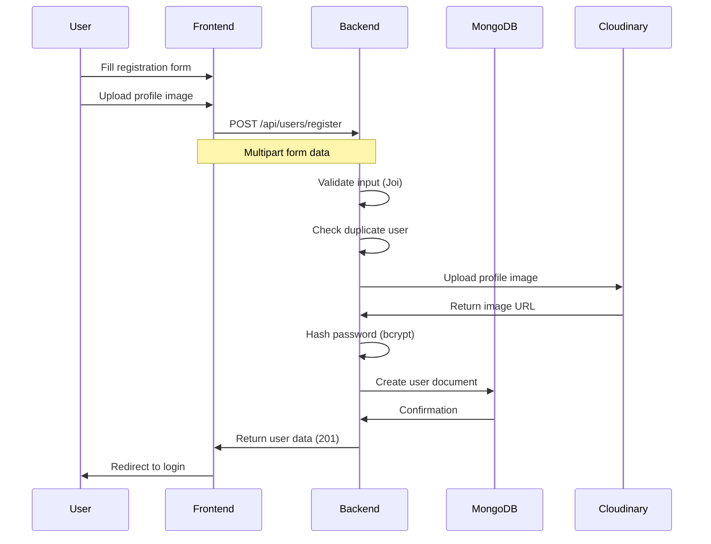

**Source Files:**
- Frontend: `Frontend/src/Pages/Auth/Register.jsx`
- Frontend API: `Frontend/src/apis/Users/index.js`
- Backend Route: `Backend(Express)/src/Routes/user.route.js`
- Backend Controller: `Backend(Express)/src/Controllers/user.controller.js`
- Backend Model: `Backend(Express)/src/Models/user.models.js`

### Login Flow

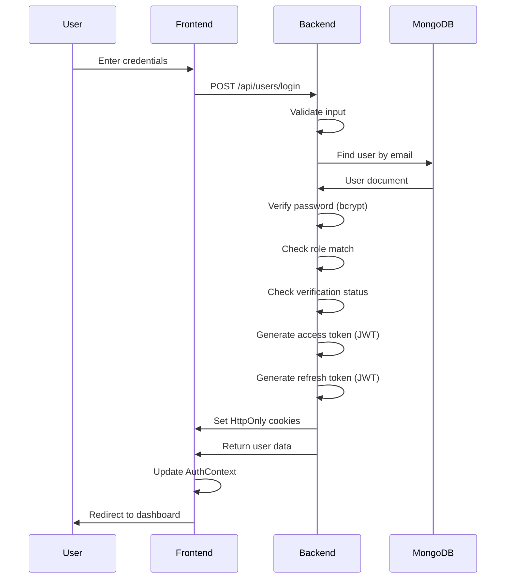

**Source Files:**
- Frontend: `Frontend/src/Pages/Auth/Login.jsx`
- Frontend API: `Frontend/src/apis/Users/index.js`
- Backend Route: `Backend(Express)/src/Routes/user.route.js`
- Backend Controller: `Backend(Express)/src/Controllers/user.controller.js`

## Student Enrollment Workflow

### Face Registration Flow

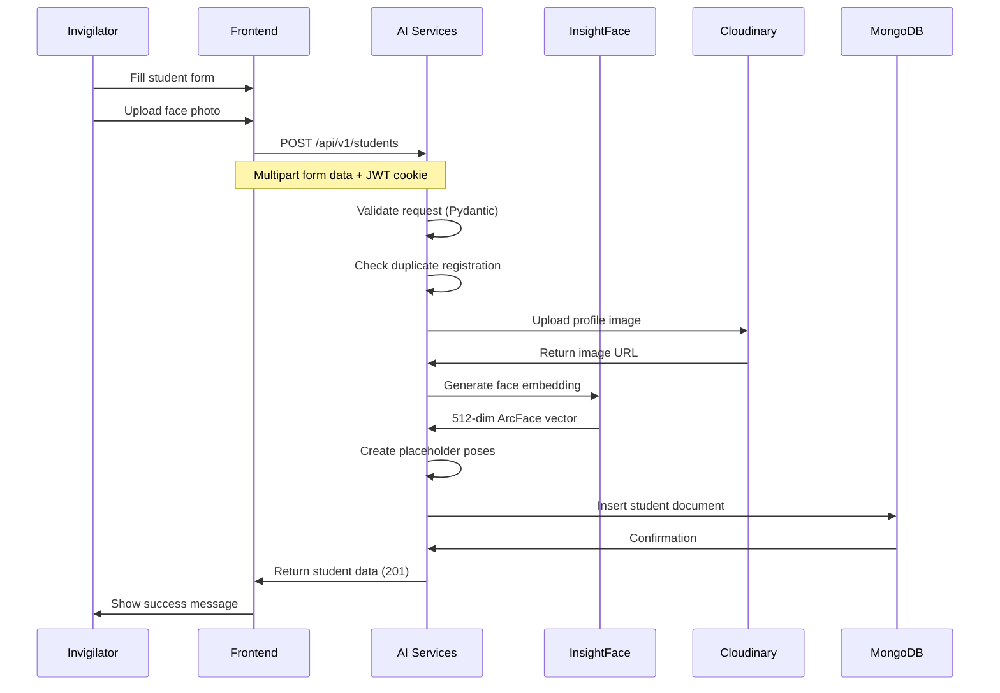

**Source Files:**
- Frontend: `Frontend/src/components/Students/Student.jsx`
- Frontend API: `Frontend/src/apis/Students/index.js`
- AI Services Route: `AI SERVICES/app/api/routes/student.py`
- AI Services Service: `AI SERVICES/app/services/backend/student_service.py`
- AI Services Model: `AI SERVICES/app/models/student.py`

### Multi-Pose Enrollment Flow

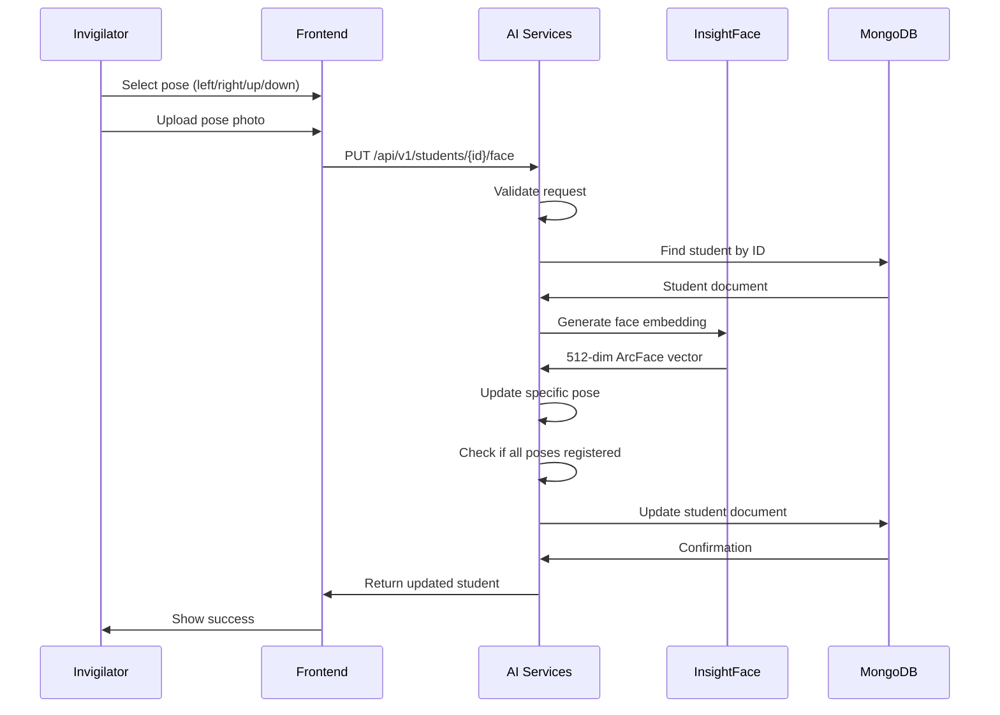

**Source Files:**
- Frontend: `Frontend/src/components/Students/StudentDetail.jsx`
- AI Services Route: `AI SERVICES/app/api/routes/student.py`
- AI Services Service: `AI SERVICES/app/services/backend/student_service.py`

## Exam Creation Workflow

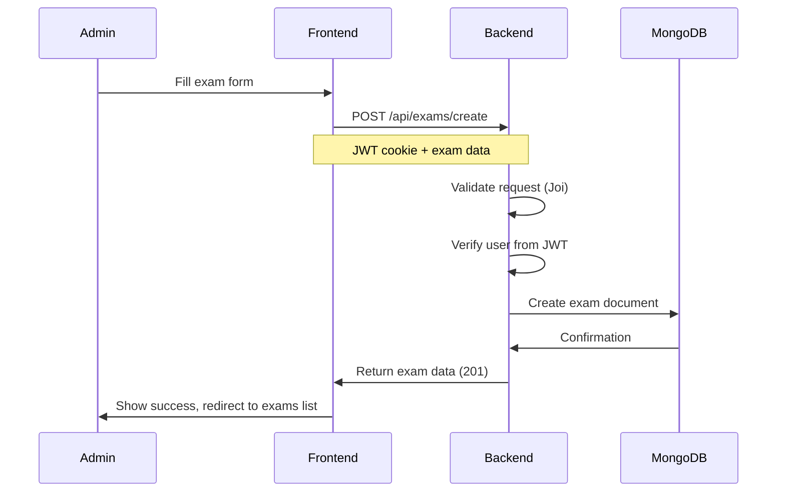

**Source Files:**
- Frontend: `Frontend/src/components/Exams/Exam.jsx`
- Frontend API: `Frontend/src/apis/Exams/index.js`
- Backend Route: `Backend(Express)/src/Routes/exam.route.js`
- Backend Controller: `Backend(Express)/src/Controllers/exam.controller.js`
- Backend Model: `Backend(Express)/src/Models/exam.models.js`

## Exam Session Workflow

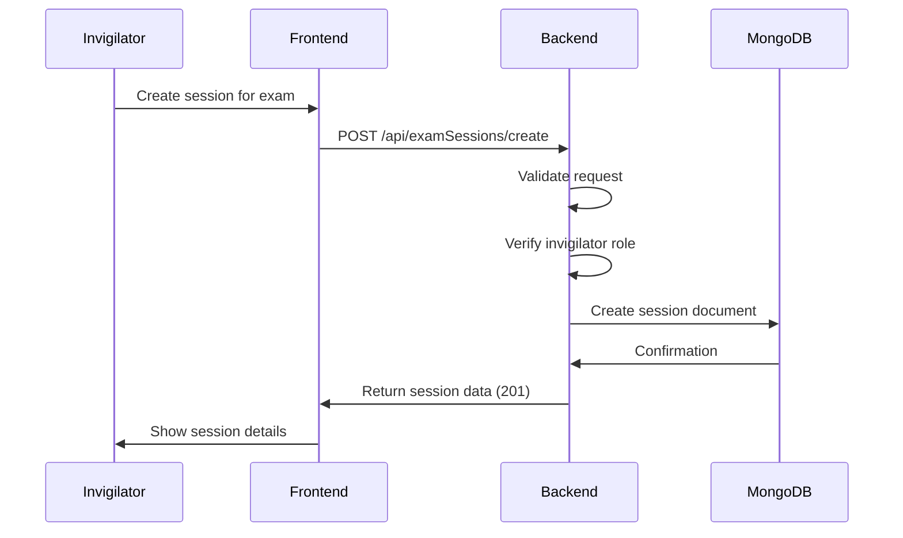

**Source Files:**
- Frontend: `Frontend/src/components/ExamSessions/ExamSessionsList.jsx`
- Frontend API: `Frontend/src/apis/ExamSessions/index.js`
- Backend Route: `Backend(Express)/src/Routes/examSession.route.js`
- Backend Controller: `Backend(Express)/src/Controllers/examSession.controller.js`
- Backend Model: `Backend(Express)/src/Models/examSession.models.js`

## Video Upload Workflow

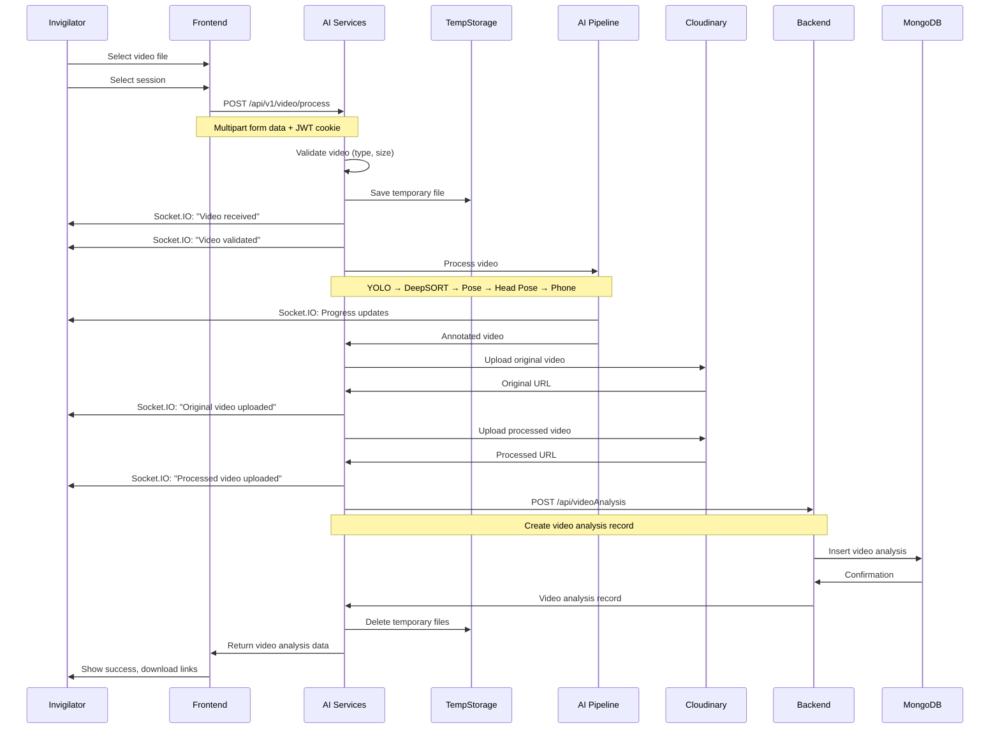

**Source Files:**
- Frontend: `Frontend/src/components/VideoUpload/VideoUpload.jsx`
- Frontend API: `Frontend/src/apis/VideoAnalysis/index.js`
- AI Services Route: `AI SERVICES/app/api/routes/video.py`
- AI Services Service: `AI SERVICES/app/services/backend/video_service.py`
- AI Services Processor: `AI SERVICES/app/services/ai/processors/video_processor.py`
- Backend Route: `Backend(Express)/src/Routes/videoAnalysis.route.js`
- Backend Controller: `Backend(Express)/src/Controllers/videoAnalysis.controller.js`

## Video Processing Workflow (AI Pipeline)

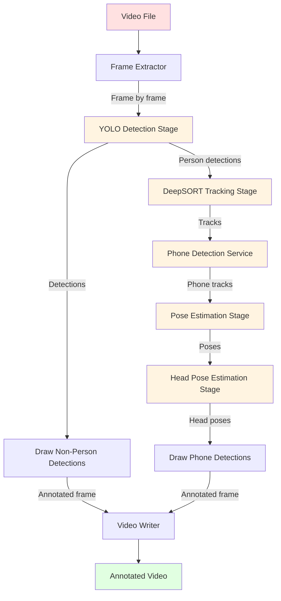

**Source Files:**
- AI Services Processor: `AI SERVICES/app/services/ai/processors/video_processor.py`
- YOLO Stage: `AI SERVICES/app/services/ai/detectors/yolo/stage.py`
- DeepSORT Stage: `AI SERVICES/app/services/ai/trackers/deepsort/stage.py`
- Pose Stage: `AI SERVICES/app/services/ai/analyzers/pose/stage.py`
- Head Pose Stage: `AI SERVICES/app/services/ai/analyzers/head_pose/stage.py`
- Phone Service: `AI SERVICES/app/services/ai/detectors/phone/service.py`

## Real-Time Logging Workflow

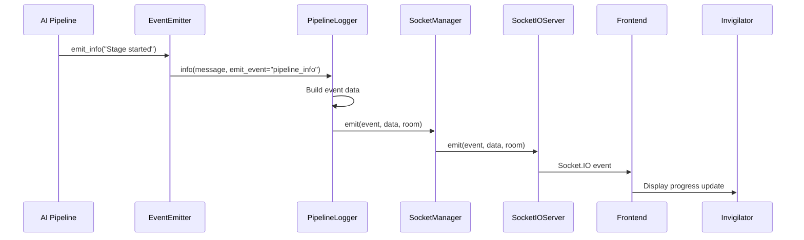

**Source Files:**
- AI Services EventEmitter: `AI SERVICES/app/services/ai/monitoring/event_emitter.py`
- AI Services Logger: `AI SERVICES/app/services/ai/monitoring/pipeline_logger.py`
- AI Services Socket Manager: `AI SERVICES/app/services/ai/monitoring/socket_manager.py`

## Phone Association Workflow

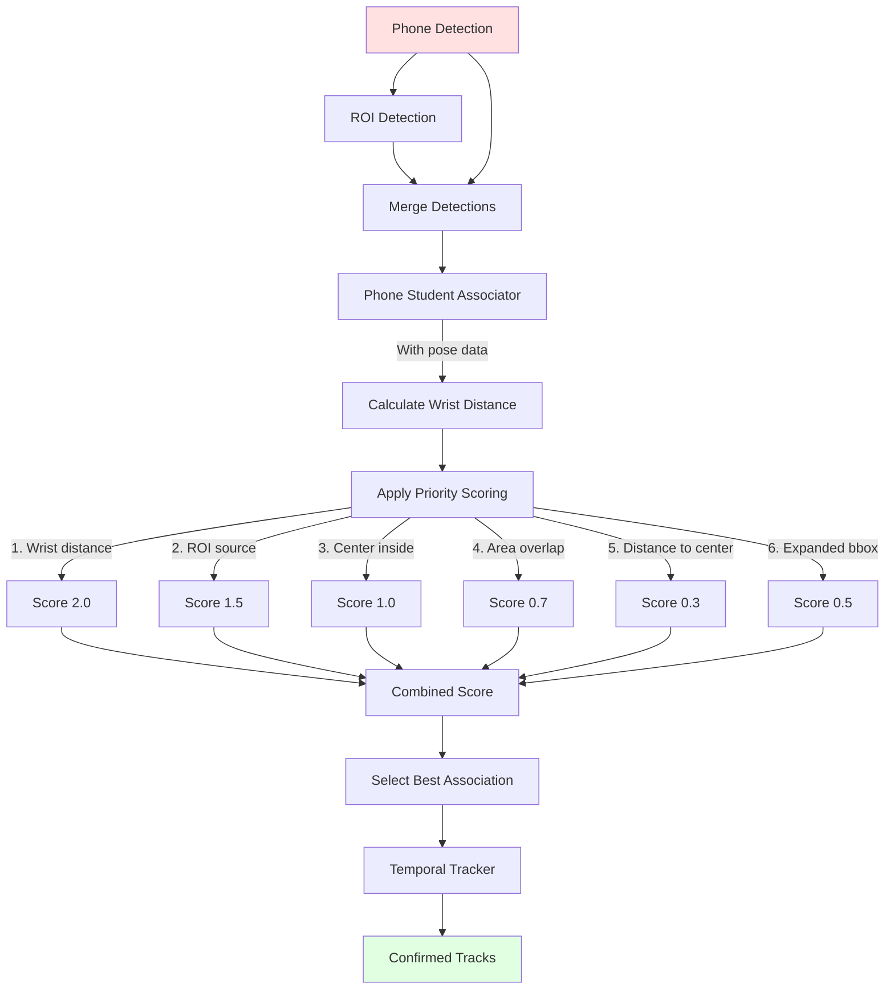

**Source Files:**
- AI Services Associator: `AI SERVICES/app/services/ai/analyzers/phone/associator.py`
- AI Services Temporal Tracker: `AI SERVICES/app/services/ai/detectors/phone/temporal_tracker.py`

## Processed Video Download Workflow

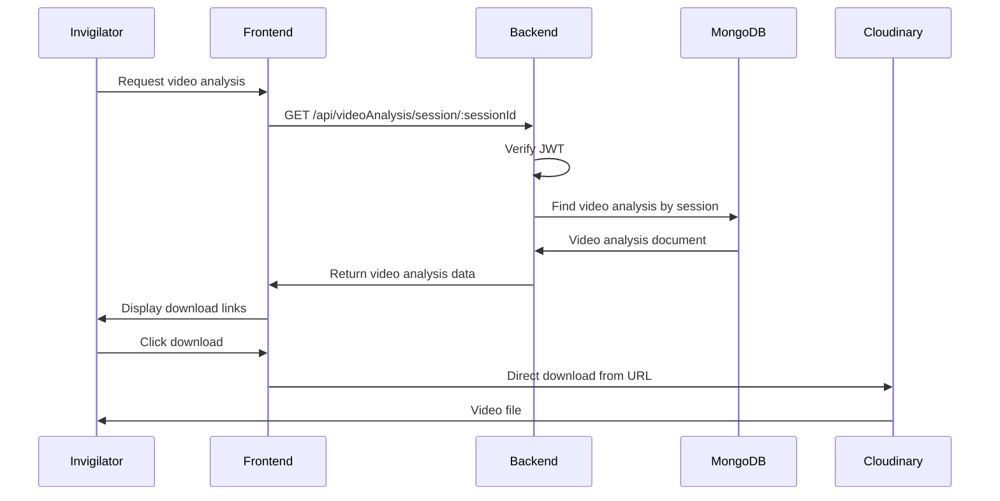

**Source Files:**
- Frontend: `Frontend/src/Pages/Dashboard/InvigilatorSessions.jsx`
- Frontend API: `Frontend/src/apis/VideoAnalysis/index.js`
- Backend Route: `Backend(Express)/src/Routes/videoAnalysis.route.js`
- Backend Controller: `Backend(Express)/src/Controllers/videoAnalysis.controller.js`

## Related Documentation

- [02 - System Architecture](02%20-%20System%20Architecture.md) - System design details
- [08 - API Reference](08%20-%20API%20Reference.md) - Complete API documentation
- [10 - Socket.IO Events](10%20-%20Socket.IO%20Events.md) - Real-time event reference
- [AI Services/Video Processing Pipeline](AI%20Services/Video%20Processing%20Pipeline.md) - AI pipeline details
