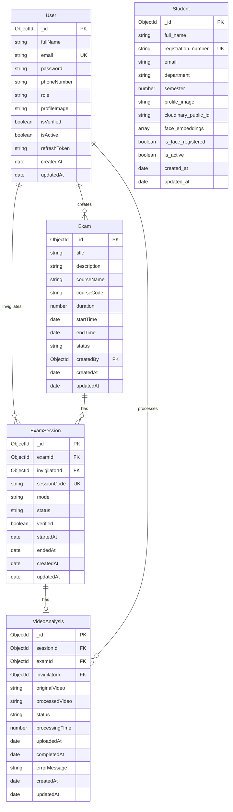

# Database Reference

This document documents all database models and schemas used in the NeuroProctor system.

## Database: MongoDB

**Connection String:** `mongodb://localhost:27017/neuroproctor`

**Database Name:** `neuroproctor`

**Drivers:**
- Backend (Express): Mongoose (synchronous)
- AI Services: Motor (asynchronous)

## Collections

### Users Collection

**Managed by:** Backend (Express)

**Schema File:** `Backend(Express)/src/Models/user.models.js`

**Schema Definition:**

| Field | Type | Required | Default | Description |
|-------|------|----------|---------|-------------|
| fullName | String | Yes | - | User's full name |
| email | String | Yes | - | User's email (unique, lowercase) |
| password | String | Yes | - | Hashed password (bcrypt) |
| phoneNumber | String | Yes | - | User's phone number |
| role | String | Yes | - | User role (invigilator/admin) |
| profileImage | String | Yes | - | Cloudinary URL for profile image |
| isVerified | Boolean | No | false | Account verification status |
| isActive | Boolean | No | false | Account active status |
| refreshToken | String | No | null | Refresh token |
| createdAt | Date | Auto | - | Creation timestamp |
| updatedAt | Date | Auto | - | Update timestamp |

**Indexes:**
- `role` - For role-based queries
- `isActive` - For active user queries
- `isVerified` - For verification queries
- `{ role: 1, isActive: 1 }` - Composite index
- `{ role: 1, isVerified: 1 }` - Composite index
- `createdAt: -1` - For chronological queries

**Methods:**
- `isPasswordMatch(password)` - Compare password with hash
- `generateAccessToken()` - Generate JWT access token
- `generateRefreshToken()` - Generate JWT refresh token

**Example Document:**
```json
{
  "_id": ObjectId("..."),
  "fullName": "John Doe",
  "email": "john@example.com",
  "password": "$2b$10$...",
  "phoneNumber": "+1234567890",
  "role": "invigilator",
  "profileImage": "https://res.cloudinary.com/...",
  "isVerified": true,
  "isActive": true,
  "refreshToken": null,
  "createdAt": ISODate("2024-01-01T00:00:00Z"),
  "updatedAt": ISODate("2024-01-01T00:00:00Z")
}
```

---

### Exams Collection

**Managed by:** Backend (Express)

**Schema File:** `Backend(Express)/src/Models/exam.models.js`

**Schema Definition:**

| Field | Type | Required | Default | Description |
|-------|------|----------|---------|-------------|
| title | String | Yes | - | Exam title |
| description | String | Yes | - | Exam description |
| courseName | String | Yes | - | Course name |
| courseCode | String | Yes | - | Course code (uppercase) |
| duration | Number | Yes | - | Duration in minutes |
| startTime | Date | Yes | - | Exam start time |
| endTime | Date | Yes | - | Exam end time |
| status | String | No | scheduled | Exam status (scheduled/ongoing/completed/cancelled) |
| createdBy | ObjectId | Yes | - | User ID who created the exam |
| createdAt | Date | Auto | - | Creation timestamp |
| updatedAt | Date | Auto | - | Update timestamp |

**Indexes:**
- `status` - For status-based queries
- `createdBy` - For user's exams
- `startTime` - For time-based queries
- `endTime` - For time-based queries
- `courseCode` - For course-based queries
- `courseName` - For course-based queries
- `{ status: 1, startTime: 1 }` - Composite index
- `{ createdBy: 1, status: 1 }` - Composite index

**Example Document:**
```json
{
  "_id": ObjectId("..."),
  "title": "Midterm Exam",
  "description": "Computer Science midterm",
  "courseName": "Computer Science",
  "courseCode": "CS101",
  "duration": 90,
  "startTime": ISODate("2024-01-15T09:00:00Z"),
  "endTime": ISODate("2024-01-15T10:30:00Z"),
  "status": "scheduled",
  "createdBy": ObjectId("..."),
  "createdAt": ISODate("2024-01-01T00:00:00Z"),
  "updatedAt": ISODate("2024-01-01T00:00:00Z")
}
```

---

### Exam Sessions Collection

**Managed by:** Backend (Express)

**Schema File:** `Backend(Express)/src/Models/examSession.models.js`

**Schema Definition:**

| Field | Type | Required | Default | Description |
|-------|------|----------|---------|-------------|
| examId | ObjectId | Yes | - | Reference to Exam |
| invigilatorId | ObjectId | Yes | - | Reference to User (invigilator) |
| sessionCode | String | Yes | - | Unique session code (uppercase) |
| mode | String | No | offline | Session mode (offline/live) |
| status | String | No | scheduled | Session status (scheduled/waiting/processing/active/completed/cancelled) |
| verified | Boolean | No | false | Session verification status |
| startedAt | Date | No | null | Session start time |
| endedAt | Date | No | null | Session end time |
| createdAt | Date | Auto | - | Creation timestamp |
| updatedAt | Date | Auto | - | Update timestamp |

**Indexes:**
- `status` - For status-based queries
- `examId` - For exam's sessions
- `invigilatorId` - For invigilator's sessions

**Example Document:**
```json
{
  "_id": ObjectId("..."),
  "examId": ObjectId("..."),
  "invigilatorId": ObjectId("..."),
  "sessionCode": "EXAM001",
  "mode": "offline",
  "status": "scheduled",
  "verified": false,
  "startedAt": null,
  "endedAt": null,
  "createdAt": ISODate("2024-01-01T00:00:00Z"),
  "updatedAt": ISODate("2024-01-01T00:00:00Z")
}
```

---

### Video Analysis Collection

**Managed by:** Backend (Express)

**Schema File:** `Backend(Express)/src/Models/videoAnalysis.models.js`

**Schema Definition:**

| Field | Type | Required | Default | Description |
|-------|------|----------|---------|-------------|
| sessionId | ObjectId | Yes | - | Reference to ExamSession |
| examId | ObjectId | Yes | - | Reference to Exam |
| invigilatorId | ObjectId | Yes | - | Reference to User (invigilator) |
| originalVideo | String | Yes | - | Cloudinary URL for original video |
| processedVideo | String | Yes | - | Cloudinary URL for processed video |
| status | String | No | pending | Analysis status (pending/processing/completed/failed) |
| processingTime | Number | No | 0 | Processing time in seconds |
| uploadedAt | Date | No | Date.now() | Upload timestamp |
| completedAt | Date | No | null | Completion timestamp |
| errorMessage | String | No | null | Error message if failed |
| createdAt | Date | Auto | - | Creation timestamp |
| updatedAt | Date | Auto | - | Update timestamp |

**Indexes:**
- `sessionId` - For session's video analysis
- `examId` - For exam's video analyses
- `invigilatorId` - For invigilator's video analyses
- `status` - For status-based queries
- `{ sessionId: 1, status: 1 }` - Composite index
- `{ invigilatorId: 1, createdAt: -1 }` - Composite index

**Example Document:**
```json
{
  "_id": ObjectId("..."),
  "sessionId": ObjectId("..."),
  "examId": ObjectId("..."),
  "invigilatorId": ObjectId("..."),
  "originalVideo": "https://res.cloudinary.com/.../original.mp4",
  "processedVideo": "https://res.cloudinary.com/.../processed.mp4",
  "status": "completed",
  "processingTime": 120.5,
  "uploadedAt": ISODate("2024-01-15T10:00:00Z"),
  "completedAt": ISODate("2024-01-15T10:02:00Z"),
  "errorMessage": null,
  "createdAt": ISODate("2024-01-15T10:00:00Z"),
  "updatedAt": ISODate("2024-01-15T10:02:00Z")
}
```

---

### Students Collection

**Managed by:** AI Services (FastAPI)

**Schema File:** `AI SERVICES/app/models/student.py`

**Schema Definition:**

| Field | Type | Required | Default | Description |
|-------|------|----------|---------|-------------|
| _id | ObjectId | Auto | - | Document ID |
| full_name | String | Yes | - | Student's full name |
| registration_number | String | Yes | - | Unique registration number |
| email | String | Yes | - | Student's email |
| department | String | Yes | - | Academic department |
| semester | Number | Yes | - | Current semester (1-8) |
| profile_image | String | Yes | - | Cloudinary URL for profile image |
| cloudinary_public_id | String | No | "" | Cloudinary public ID for deletion |
| face_embeddings | Array | No | [] | Array of face embedding subdocuments |
| is_face_registered | Boolean | No | false | Face registration status |
| is_active | Boolean | No | true | Active status (soft delete) |
| created_at | Date | Auto | UTC | Creation timestamp |
| updated_at | Date | Auto | UTC | Update timestamp |

**Face Embedding Subdocument:**

| Field | Type | Required | Default | Description |
|-------|------|----------|---------|-------------|
| pose | String | Yes | - | Head pose (front/left/right/up/down) |
| embedding | Array[float] | No | [] | 512-dimensional ArcFace vector |
| quality_score | Float | No | 0.0 | Detection confidence (0.0-1.0) |
| captured_at | Date | No | null | Capture timestamp |

**Valid Poses:** `["front", "left", "right", "up", "down"]`

**Example Document:**
```json
{
  "_id": ObjectId("..."),
  "full_name": "Jane Smith",
  "registration_number": "SP23-BCS-183",
  "email": "jane@university.edu",
  "department": "Computer Science",
  "semester": 3,
  "profile_image": "https://res.cloudinary.com/.../student.jpg",
  "cloudinary_public_id": "neuroproctor/students/abc123",
  "face_embeddings": [
    {
      "pose": "front",
      "embedding": [0.1, 0.2, ..., 0.9], // 512 values
      "quality_score": 0.95,
      "captured_at": ISODate("2024-01-01T00:00:00Z")
    },
    {
      "pose": "left",
      "embedding": [0.1, 0.2, ..., 0.9],
      "quality_score": 0.92,
      "captured_at": ISODate("2024-01-01T00:05:00Z")
    },
    {
      "pose": "right",
      "embedding": [],
      "quality_score": 0.0,
      "captured_at": null
    },
    {
      "pose": "up",
      "embedding": [],
      "quality_score": 0.0,
      "captured_at": null
    },
    {
      "pose": "down",
      "embedding": [],
      "quality_score": 0.0,
      "captured_at": null
    }
  ],
  "is_face_registered": true,
  "is_active": true,
  "created_at": ISODate("2024-01-01T00:00:00Z"),
  "updated_at": ISODate("2024-01-01T00:05:00Z")
}
```

---

## Database Relationships

### Entity Relationship Diagram



### Relationship Descriptions

**User → Exam**
- One user (admin/invigilator) can create many exams
- Relationship: One-to-Many
- Foreign Key: `Exam.createdBy` → `User._id`

**User → ExamSession**
- One user (invigilator) can be assigned to many exam sessions
- Relationship: One-to-Many
- Foreign Key: `ExamSession.invigilatorId` → `User._id`

**Exam → ExamSession**
- One exam can have many exam sessions
- Relationship: One-to-Many
- Foreign Key: `ExamSession.examId` → `Exam._id`

**ExamSession → VideoAnalysis**
- One exam session has one video analysis record
- Relationship: One-to-One
- Foreign Key: `VideoAnalysis.sessionId` → `ExamSession._id`

**User → VideoAnalysis**
- One user (invigilator) can process many video analyses
- Relationship: One-to-Many
- Foreign Key: `VideoAnalysis.invigilatorId` → `User._id`

**Student**
- Independent collection (no direct relationships to other collections)
- Used for face enrollment and matching in AI pipeline

---

## Database Access Patterns

### Backend (Express) - Mongoose

**Connection:** `Backend(Express)/src/Config/db.js`

**Example Usage:**
```javascript
import User from "../Models/user.models.js";

// Find user by email
const user = await User.findOne({ email });

// Create new user
const newUser = await User.create({ fullName, email, password, ... });

// Update user
await User.findByIdAndUpdate(id, { isVerified: true }, { new: true });

// Delete user
await User.findByIdAndDelete(id);
```

### AI Services - Motor (Async)

**Connection:** `AI SERVICES/app/config/database.py`

**Example Usage:**
```python
from motor.motor_asyncio import AsyncIOMotorClient
from app.models.student import StudentDocument

# Find student by ID
student_dict = await db.students.find_one({"_id": student_id})
student = StudentDocument(**student_dict)

# Create new student
student_dict = student.model_dump(mode="json", exclude={"id"})
result = await db.students.insert_one(student_dict)

# Update student
await db.students.update_one(
    {"_id": student_id},
    {"$set": update_dict}
)

# Delete student
await db.students.delete_one({"_id": student_id})
```

---

## Database Indexes Summary

### Users Collection Indexes
- `role` - Single field
- `isActive` - Single field
- `isVerified` - Single field
- `{ role: 1, isActive: 1 }` - Composite
- `{ role: 1, isVerified: 1 }` - Composite
- `createdAt: -1` - Single field (descending)

### Exams Collection Indexes
- `status` - Single field
- `createdBy` - Single field
- `startTime` - Single field
- `endTime` - Single field
- `courseCode` - Single field
- `courseName` - Single field
- `{ status: 1, startTime: 1 }` - Composite
- `{ createdBy: 1, status: 1 }` - Composite

### Exam Sessions Collection Indexes
- `status` - Single field
- `examId` - Single field
- `invigilatorId` - Single field

### Video Analysis Collection Indexes
- `sessionId` - Single field
- `examId` - Single field
- `invigilatorId` - Single field
- `status` - Single field
- `{ sessionId: 1, status: 1 }` - Composite
- `{ invigilatorId: 1, createdAt: -1 }` - Composite

### Students Collection Indexes
- `registration_number` - Unique (implied by business logic)
- `email` - Unique (implied by business logic)

---

## Related Documentation

- [08 - API Reference](08%20-%20API%20Reference.md) - API endpoints that interact with database
- [02 - System Architecture](02%20-%20System%20Architecture.md) - System design overview
- [Reference/Model Relationships](Reference/Model%20Relationships.md) - Detailed relationship documentation
