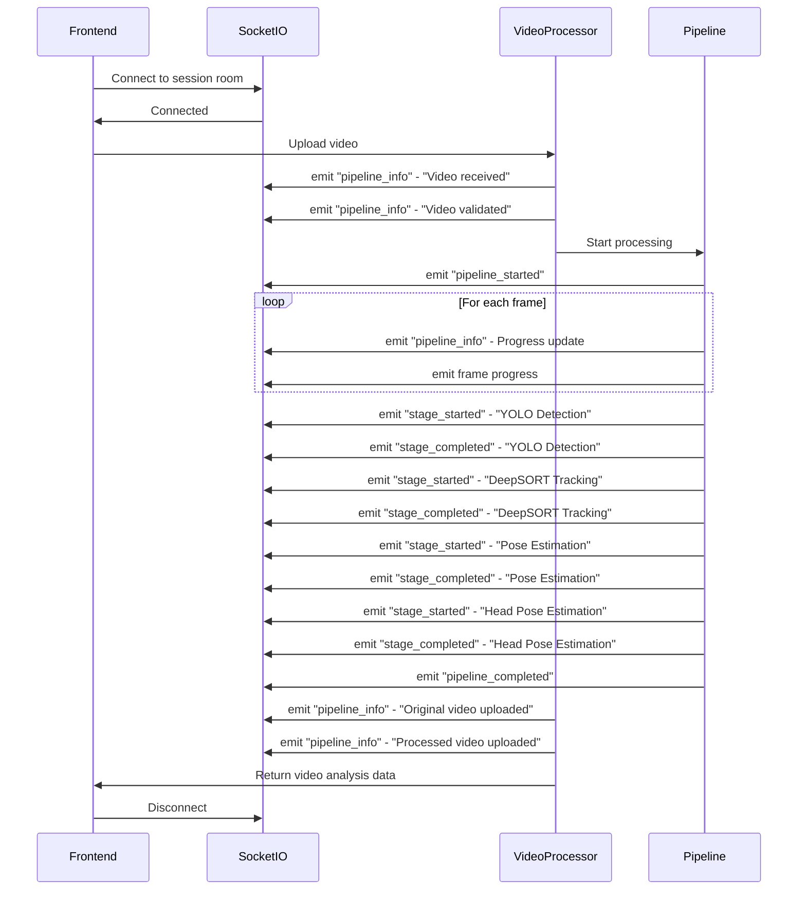

# Socket.IO Events

This document documents all Socket.IO events used in the NeuroProctor system for real-time communication.

## Overview

**Socket.IO Server:** AI Services (FastAPI)

**Server Implementation:** `AI SERVICES/app/services/ai/monitoring/socket_manager.py`

**Client Implementation:** Frontend uses Socket.IO Client library

**Connection URL:** `http://localhost:8000` (AI Services)

## Socket.IO Manager

The Socket.IO manager is a centralized class that manages the Socket.IO server, active clients, and event broadcasting.

**File:** `AI SERVICES/app/services/ai/monitoring/socket_manager.py`

**Key Methods:**
- `emit(event, data, room)` - Emit event to clients
- `join_room(sid, room)` - Join client to a room
- `leave_room(sid, room)` - Remove client from a room

**Built-in Events:**
- `connect` - Client connected
- `disconnect` - Client disconnected

## Pipeline Events

These events are emitted during video processing to provide real-time progress updates to the frontend.

### pipeline_info

**Description:** General pipeline information event

**Emitted by:** `EventEmitter.emit_info()`

**Data Structure:**
```json
{
  "message": "Video received",
  "data": {
    "session_id": "string",
    "exam_id": "string"
  }
}
```

**Source:** `AI SERVICES/app/services/ai/monitoring/event_emitter.py`

**Usage Examples:**
- "Video received"
- "Video validated successfully"
- "Temporary file created"
- "AI pipeline completed"
- "Original video uploaded"
- "Processed video uploaded"

---

### pipeline_warning

**Description:** Pipeline warning event

**Emitted by:** `EventEmitter.emit_warning()`

**Data Structure:**
```json
{
  "message": "Warning message",
  "data": {
    "warning": "string"
  }
}
```

**Source:** `AI SERVICES/app/services/ai/monitoring/event_emitter.py`

---

### pipeline_error

**Description:** Pipeline error event

**Emitted by:** `EventEmitter.emit_error()`

**Data Structure:**
```json
{
  "message": "Error message",
  "data": {
    "error": "string"
  }
}
```

**Source:** `AI SERVICES/app/services/ai/monitoring/event_emitter.py`

---

### stage_started

**Description:** Emitted when a pipeline stage starts processing

**Emitted by:** `EventEmitter.emit_stage_started()`

**Data Structure:**
```json
{
  "message": "Stage started: YOLO Detection",
  "data": {
    "stage": "YOLO Detection"
  }
}
```

**Source:** `AI SERVICES/app/services/ai/monitoring/event_emitter.py`

**Known Stages:**
- "AI Pipeline"
- "YOLO Detection"
- "DeepSORT Tracking"
- "Pose Estimation"
- "Head Pose Estimation"
- "Phone Detection"

---

### stage_completed

**Description:** Emitted when a pipeline stage completes processing

**Emitted by:** `EventEmitter.emit_stage_completed()`

**Data Structure:**
```json
{
  "message": "Stage completed: YOLO Detection",
  "data": {
    "stage": "YOLO Detection"
  }
}
```

**Source:** `AI SERVICES/app/services/ai/monitoring/event_emitter.py`

---

### pipeline_started

**Description:** Emitted when the entire pipeline starts

**Emitted by:** `EventEmitter.emit_pipeline_started()`

**Data Structure:**
```json
{
  "message": "Pipeline started",
  "data": {
    "session_id": "string",
    "exam_id": "string"
  }
}
```

**Source:** `AI SERVICES/app/services/ai/monitoring/event_emitter.py`

---

### pipeline_completed

**Description:** Emitted when the entire pipeline completes successfully

**Emitted by:** `EventEmitter.emit_pipeline_completed()`

**Data Structure:**
```json
{
  "message": "Pipeline completed",
  "data": {
    "processing_time": 120.5,
    "detections": {
      "person": 150,
      "cell phone": 5
    }
  }
}
```

**Source:** `AI SERVICES/app/services/ai/monitoring/event_emitter.py`

---

### pipeline_failed

**Description:** Emitted when the pipeline fails

**Emitted by:** `EventEmitter.emit_pipeline_failed()`

**Data Structure:**
```json
{
  "message": "Pipeline failed: Out of memory",
  "data": {
    "error": "Out of memory",
    "session_id": "string"
  }
}
```

**Source:** `AI SERVICES/app/services/ai/monitoring/event_emitter.py`

---

## Video Processing Progress Events

These events are emitted during video frame processing to show progress.

### Frame Progress Event

**Description:** Emitted for each frame during processing

**Emitted by:** `VideoProcessor.process_video()`

**Data Structure:**
```json
{
  "message": "Processing frame 100/1000 (10%)",
  "data": {
    "frame_number": 100,
    "total_frames": 1000,
    "progress": 10,
    "stage": "video_processing"
  }
}
```

**Source:** `AI SERVICES/app/services/ai/processors/video_processor.py`

---

## Event Flow During Video Processing



---

## Frontend Socket.IO Integration

**File:** `Frontend/src/Pages/Dashboard/InvigilatorSessions.jsx`

**Connection Setup:**
```javascript
import { io } from 'socket.io-client';

const socket = io('http://localhost:8000', {
  withCredentials: true, // Send cookies
  transports: ['websocket']
});

// Join session room
socket.emit('join', { sessionId });

// Listen for events
socket.on('pipeline_info', (data) => {
  console.log('Pipeline info:', data);
  updateProgress(data);
});

socket.on('stage_started', (data) => {
  console.log('Stage started:', data.stage);
  updateStage(data.stage);
});

socket.on('pipeline_completed', (data) => {
  console.log('Pipeline completed:', data);
  handleCompletion(data);
});

socket.on('pipeline_error', (data) => {
  console.error('Pipeline error:', data);
  handleError(data);
});
```

---

## Room-Based Communication

The Socket.IO manager supports room-based communication to target events to specific clients.

**Join Room:**
```python
await socket_manager.join_room(sid, room="session_123")
```

**Emit to Room:**
```python
await socket_manager.emit("pipeline_info", data, room="session_123")
```

**Leave Room:**
```python
await socket_manager.leave_room(sid, room="session_123")
```

**Use Case:** During video processing, events are emitted to a specific session room so only clients viewing that session receive updates.

---

## Event Emitter Helper

**File:** `AI SERVICES/app/services/ai/monitoring/event_emitter.py`

The `EventEmitter` class provides reusable methods for emitting standard pipeline events, reducing code duplication.

**Methods:**
- `emit_info(message, data)` - Emit info event
- `emit_warning(message, data)` - Emit warning event
- `emit_error(message, data)` - Emit error event
- `emit_stage_started(stage_name, data)` - Emit stage started event
- `emit_stage_completed(stage_name, data)` - Emit stage completed event
- `emit_pipeline_started(data)` - Emit pipeline started event
- `emit_pipeline_completed(data)` - Emit pipeline completed event
- `emit_pipeline_failed(error, data)` - Emit pipeline failed event

---

## Pipeline Logger

**File:** `AI SERVICES/app/services/ai/monitoring/pipeline_logger.py`

The `PipelineLogger` class handles logging and Socket.IO event emission for pipeline operations.

**Key Methods:**
- `info(message, emit_event, data)` - Log info and optionally emit event
- `warning(message, emit_event, data)` - Log warning and optionally emit event
- `error(message, emit_event, data)` - Log error and optionally emit event

**Usage:**
```python
pipeline_logger = PipelineLogger(session_id="session_123")

# Log without emitting
pipeline_logger.info("Processing frame 100")

# Log and emit event
pipeline_logger.info("Stage completed", emit_event="stage_completed", data={"stage": "YOLO"})
```

---

## Event Data Contracts

### Standard Event Envelope

All events follow a standard envelope structure:

```json
{
  "message": "Human-readable message",
  "data": {
    "key": "value"
  }
}
```

### Progress Data

```json
{
  "frame_number": number,
  "total_frames": number,
  "progress": number, // 0-100
  "stage": string
}
```

### Stage Data

```json
{
  "stage": string,
  "timestamp": string
}
```

### Error Data

```json
{
  "error": string,
  "session_id": string,
  "timestamp": string
}
```

---

## Security Considerations

### Authentication

Socket.IO connections require JWT authentication via HttpOnly cookies, same as REST API endpoints.

**Implementation:**
- Frontend sends cookies automatically with `withCredentials: true`
- AI Services verifies JWT via `require_roles` dependency
- Unauthorized connections are rejected

### CORS

Socket.IO CORS is configured to allow all origins in development:

```python
self._sio = socketio.AsyncServer(
    async_mode="asgi",
    cors_allowed_origins="*",
)
```

**Production Recommendation:** Restrict to actual frontend origin.

---

## Debugging Socket.IO

### Enable Debug Logging

Set `APP_DEBUG=True` in AI Services `.env` to enable detailed Socket.IO logging.

### Monitor Events

Use browser DevTools to monitor Socket.IO events:
1. Open DevTools → Network tab
2. Filter by WS (WebSocket)
3. Select the WebSocket connection
4. View messages in the Messages tab

### Common Issues

**Issue:** Events not received on frontend

**Solutions:**
1. Verify Socket.IO server is running on correct port
2. Check CORS configuration
3. Verify JWT cookie is being sent
4. Check room membership
5. Verify event name matches exactly

**Issue:** Connection drops frequently

**Solutions:**
1. Check network stability
2. Increase heartbeat timeout
3. Verify WebSocket transport is enabled
4. Check server logs for disconnection reasons

---

## Related Documentation

- [08 - API Reference](08%20-%20API%20Reference.md) - REST API endpoints
- [04 - End-to-End Workflows](04%20-%20End-to-End%20Workflows.md) - Event usage in workflows
- [AI Services/AI Architecture](AI%20Services/AI%20Architecture.md) - AI Services architecture
