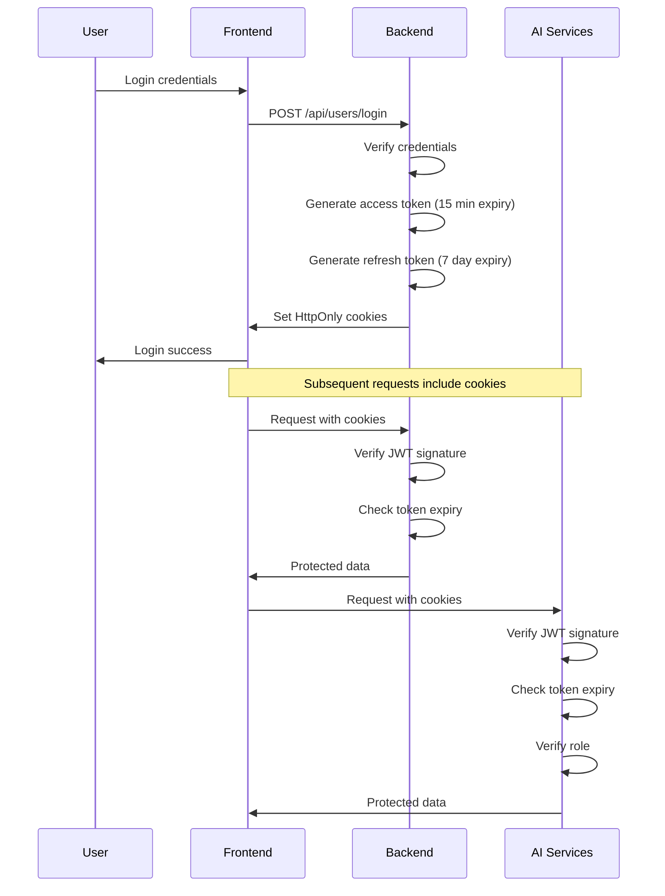

# Security and Authentication

This document describes the security and authentication implementation across the NeuroProctor system.

## Authentication Overview

NeuroProctor uses JWT (JSON Web Tokens) for authentication, shared between the Backend (Express) and AI Services (FastAPI).

### Authentication Flow



## JWT Implementation

### Token Generation

**Backend (Express):** `Backend(Express)/src/Utils/index.utils.js`

```javascript
userSchema.methods.generateAccessToken = function () {
    return jwt.sign(
        {
            _id: this._id,
            email: this.email,
            fullName: this.fullName,
            role: this.role,
        },
        process.env.ACCESS_TOKEN_SECRET,
        {
            expiresIn: process.env.ACCESS_TOKEN_EXPIRY,
        }
    );
};

userSchema.methods.generateRefreshToken = function () {
    return jwt.sign(
        {
            _id: this._id,
            email: this.email,
            fullName: this.fullName,
            role: this.role,
        },
        process.env.REFRESH_TOKEN_SECRET,
        {
            expiresIn: process.env.REFRESH_TOKEN_EXPIRY,
        }
    );
};
```

### Token Payload

Both access and refresh tokens contain the following payload:

```json
{
  "_id": "user_id",
  "email": "user@example.com",
  "fullName": "John Doe",
  "role": "invigilator"
}
```

### Token Configuration

| Setting | Value | Description |
|---------|-------|-------------|
| Access Token Secret | From `.env` | Secret key for signing access tokens |
| Refresh Token Secret | From `.env` | Secret key for signing refresh tokens |
| Access Token Expiry | `15m` | Access token valid for 15 minutes |
| Refresh Token Expiry | `7d` | Refresh token valid for 7 days |
| Algorithm | `HS256` | HMAC SHA-256 algorithm |

**Important:** The `ACCESS_TOKEN_SECRET` must be identical in both Backend and AI Services `.env` files for JWT verification to work.

## Cookie Configuration

### Cookie Settings

**Backend (Express):** `Backend(Express)/src/Options/cookie.options.js`

```javascript
export const cookieOptions = {
    httpOnly: true,
    secure: false, // Set to true in production with HTTPS
    sameSite: 'lax',
    maxAge: 7 * 24 * 60 * 60 * 1000, // 7 days
};
```

**Cookie Attributes:**
- `httpOnly: true` - Cookies cannot be accessed via JavaScript (XSS protection)
- `secure: false` - Cookies sent over HTTP only (set to true in production with HTTPS)
- `sameSite: 'lax'` - CSRF protection
- `maxAge: 7 days` - Cookie expiration matches refresh token

### Cookies Set

| Cookie Name | Purpose | Expiry |
|-------------|---------|--------|
| `accessToken` | JWT access token | 15 minutes |
| `refreshToken` | JWT refresh token | 7 days |

## Role-Based Access Control

### Roles

| Role | Description | Permissions |
|------|-------------|--------------|
| `admin` | System administrator | Full system access, user management, exam oversight |
| `invigilator` | Exam proctor | Exam creation, session management, video upload and analysis |

### Backend (Express) Implementation

**Middleware:** `Backend(Express)/src/Middleware/auth.middleware.js`

```javascript
export const verifyJWT = async (req, res, next) => {
    try {
        const token = req.cookies?.accessToken;
        
        if (!token) {
            throw new ApiError(401, "Unauthorized request");
        }
        
        const decodedToken = jwt.verify(token, process.env.ACCESS_TOKEN_SECRET);
        req.user = decodedToken;
        next();
    } catch (error) {
        throw new ApiError(401, error?.message || "Invalid access token");
    }
};
```

**Usage in Routes:**
```javascript
userRouter.post("/login", loginValidation, loginUser);
userRouter.post("/logout", verifyJWT, logoutUser);
userRouter.get("/", verifyJWT, getUser);
```

### AI Services Implementation

**Dependency:** `AI SERVICES/app/api/dependencies.py`

```python
def require_roles(allowed_roles: List[str]) -> Callable:
    """Dependency factory for role-based authorization."""
    
    async def dependency(
        request: Request,
        token_payload: TokenPayload = Depends(verify_jwt),
    ) -> TokenPayload:
        if token_payload.role not in allowed_roles:
            raise HTTPException(
                status_code=status.HTTP_403_FORBIDDEN,
                detail=f"Role '{token_payload.role}' not in {allowed_roles}",
            )
        return token_payload
    
    return dependency
```

**Usage in Routes:**
```python
_protected = require_roles(["admin", "invigilator"])

@router.post("", current_user: TokenPayload = Depends(_protected)):
    # Handler logic
```

### Frontend Implementation

**Protected Routes:** `Frontend/src/components/ProtectedRoute.jsx`

```javascript
const ProtectedRoute = ({ children }) => {
    const { user } = useAuth();
    const location = useLocation();
    
    if (!user) {
        return <Navigate to="/login" state={{ from: location }} replace />;
    }
    
    return children;
};
```

**Role-Specific Routes:** `Frontend/src/components/AdminProtectedRoute.jsx`

```javascript
const AdminProtectedRoute = ({ children }) => {
    const { user } = useAuth();
    
    if (!user || user.role !== 'admin') {
        return <Navigate to="/unauthorized" replace />;
    }
    
    return children;
};
```

## Password Security

### Password Hashing

**Backend (Express):** `Backend(Express)/src/Models/user.models.js`

```javascript
userSchema.pre("save", async function (next) {
    try {
        if (this.isModified("password")) {
            const hashedPassword = await bcrypt.hash(this.password, 10);
            this.password = hashedPassword;
        }
    } catch (error) {
        console.log(error);
        next(error);
    }
});
```

**Configuration:**
- Algorithm: bcrypt
- Salt rounds: 10
- Hashing occurs automatically before saving user document

### Password Verification

```javascript
userSchema.methods.isPasswordMatch = async function (password) {
    return bcrypt.compare(password, this.password);
};
```

## CORS Configuration

### Backend (Express)

CORS is configured in the Express app to allow requests from the frontend.

### AI Services (FastAPI)

**Configuration:** `AI SERVICES/main.py`

```python
application.add_middleware(
    CORSMiddleware,
    allow_origins=["*"],  # Temporarily allow all origins for debugging
    allow_credentials=True,  # Critical: enables HttpOnly cookie forwarding
    allow_methods=["GET", "POST", "PUT", "DELETE", "OPTIONS", "PATCH"],
    allow_headers=[
        "Content-Type",
        "Authorization",
        "X-Requested-With",
        "Accept",
        "Origin",
    ],
)
```

**Important Notes:**
- `allow_credentials=True` is required for HttpOnly cookie forwarding
- `allow_origins=["*"]` allows all origins (should be restricted in production)
- The browser will not send cookies unless the origin matches exactly

## Security Best Practices

### Implemented

✅ **Password Hashing** - bcrypt with 10 salt rounds
✅ **HttpOnly Cookies** - Cookies not accessible via JavaScript
✅ **JWT Authentication** - Stateless token-based auth
✅ **Role-Based Access Control** - Role checks on protected endpoints
✅ **Token Expiration** - Short-lived access tokens (15 min)
✅ **SameSite Cookies** - CSRF protection
✅ **Input Validation** - Joi validation on backend, Pydantic on AI Services

### Recommended for Production

⚠️ **HTTPS Required** - Enable `secure: true` for cookies in production
⚠️ **Restrict CORS Origins** - Set `allow_origins` to actual frontend domain
⚠️ **Strong Secrets** - Use strong, randomly generated JWT secrets
⚠️ **Secret Rotation** - Implement periodic secret rotation
⚠️ **Rate Limiting** - Add rate limiting to prevent brute force attacks
⚠️ **IP Whitelisting** - Consider IP whitelisting for admin endpoints
⚠️ **Audit Logging** - Log all authentication attempts and failures
⚠️ **Session Management** - Implement session invalidation on logout
⚠️ **Token Refresh** - Implement automatic token refresh mechanism

## Known Security Considerations

### Current Limitations

1. **No Refresh Token Endpoint** - Refresh tokens are stored but not used for token renewal
2. **No Account Lockout** - No mechanism to lock accounts after failed login attempts
3. **No Password Complexity Requirements** - No password strength validation
4. **No Two-Factor Authentication** - No 2FA implementation
5. **CORS Allows All Origins** - Development configuration allows all origins
6. **No Request Signing** - API requests rely solely on JWT in cookies

### Recommended Improvements

1. **Implement Refresh Token Endpoint** - Allow token renewal without re-login
2. **Add Account Lockout** - Lock accounts after N failed attempts
3. **Password Policy** - Enforce complexity requirements
4. **Add 2FA** - Implement two-factor authentication for sensitive operations
5. **Restrict CORS** - Set specific allowed origins in production
6. **Request Signing** - Add signature verification for critical operations
7. **Audit Trail** - Log all authentication and authorization events
8. **Session Revocation** - Implement token blacklist for logout

## Environment Variables Security

### Critical Variables

The following environment variables are critical for security:

| Variable | Purpose | Risk if Compromised |
|----------|---------|---------------------|
| `ACCESS_TOKEN_SECRET` | Signs access tokens | Can forge tokens, impersonate any user |
| `REFRESH_TOKEN_SECRET` | Signs refresh tokens | Can forge tokens, long-term access |
| `CLOUDINARY_API_SECRET` | Cloudinary API access | Can upload/delete arbitrary files |
| `MONGO_URI` | Database connection | Can access all data |

### Best Practices

1. **Never commit secrets to version control**
2. **Use environment-specific secrets**
3. **Rotate secrets regularly**
4. **Use secrets manager in production** (AWS Secrets Manager, HashiCorp Vault)
5. **Limit secret access to necessary personnel**
6. **Audit secret access logs**

## Related Documentation

- [07 - Environment Variables](07%20-%20Environment%20Variables.md) - Configuration reference
- [08 - API Reference](08%20-%20API%20Reference.md) - API endpoint security
- [02 - System Architecture](02%20-%20System%20Architecture.md) - System security design
