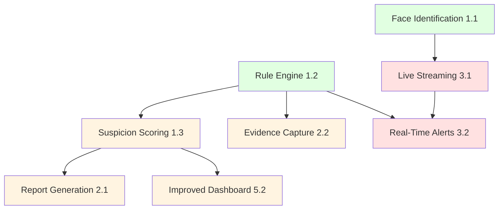

# Development Roadmap

This document outlines the recommended development priorities and roadmap for the NeuroProctor project.

## Current Status

**Maturity Level:** Early Development / Prototype

**Completed:**
- ✅ User authentication and authorization
- ✅ Role-based access control
- ✅ Exam and session management
- ✅ Student face enrollment with multi-pose embeddings
- ✅ Video upload and processing
- ✅ AI pipeline (YOLO, DeepSORT, Pose, Head Pose, Phone)
- ✅ Real-time Socket.IO logging
- ✅ Cloudinary integration
- ✅ MongoDB persistence

**Missing Core Features:**
- ❌ Face identification in video
- ❌ Cheating rule engine
- ❌ Suspicion scoring
- ❌ Report generation
- ❌ Live monitoring

## Recommended Development Phases

### Phase 1: Core AI Features (Priority: Critical)

**Goal:** Complete the core cheating detection capabilities

#### 1.1 Face Identification in Video

**Description:** Integrate face detection and matching into the video processing pipeline

**Tasks:**
- [ ] Add face detection stage to video pipeline
- [ ] Extract face embeddings from detected faces
- [ ] Match embeddings against enrolled student database
- [ ] Track faces across frames
- [ ] Generate impersonation alerts
- [ ] Add face identification to video annotations

**Estimated Effort:** 2-3 weeks

**Dependencies:** None (can start immediately)

**Files to Create/Modify:**
- `AI SERVICES/app/services/ai/recognition/face_recognizer.py` (extend)
- `AI SERVICES/app/services/ai/processors/video_processor.py` (add face stage)
- `AI SERVICES/app/services/ai/pipeline/` (add face stage)

---

#### 1.2 Cheating Rule Engine

**Description:** Implement a configurable rule evaluation system

**Tasks:**
- [ ] Design rule schema (conditions, actions, thresholds)
- [ ] Implement rule evaluation engine
- [ ] Create rule management API endpoints
- [ ] Build rule management UI in frontend
- [ ] Integrate rule engine with video pipeline
- [ ] Add default rules for common cheating behaviors

**Estimated Effort:** 3-4 weeks

**Dependencies:** None (can start immediately)

**Files to Create/Modify:**
- `AI SERVICES/app/services/ai/rules/` (new directory)
- `AI SERVICES/app/api/routes/rules.py` (new)
- `Frontend/src/components/Rules/` (new)

---

#### 1.3 Suspicion Scoring

**Description:** Implement a scoring system to quantify cheating behavior

**Tasks:**
- [ ] Design scoring algorithm
- [ ] Implement temporal smoothing for scores
- [ ] Create scoring dashboard in frontend
- [ ] Add threshold-based alerting
- [ ] Integrate with rule engine
- [ ] Add score visualization in video annotations

**Estimated Effort:** 2-3 weeks

**Dependencies:** Rule Engine (1.2)

**Files to Create/Modify:**
- `AI SERVICES/app/services/ai/scoring/` (new directory)
- `Frontend/src/components/Dashboard/SuspicionScores.jsx` (new)

---

### Phase 2: Reporting and Evidence (Priority: High)

**Goal:** Enable comprehensive reporting and evidence management

#### 2.1 Report Generation

**Description:** Generate PDF reports with evidence and statistics

**Tasks:**
- [ ] Choose PDF generation library (e.g., ReportLab, WeasyPrint)
- [ ] Design report template
- [ ] Compile evidence from video (screenshots, timestamps)
- [ ] Generate statistical summaries
- [ ] Create report download endpoint
- [ ] Add report generation UI

**Estimated Effort:** 2-3 weeks

**Dependencies:** Suspicion Scoring (1.3)

**Files to Create/Modify:**
- `AI SERVICES/app/services/ai/reports/` (new directory)
- `AI SERVICES/app/api/routes/reports.py` (new)
- `Frontend/src/components/Reports/` (new)

---

#### 2.2 Evidence Capture

**Description:** Capture and store evidence frames during processing

**Tasks:**
- [ ] Design evidence capture system
- [ ] Capture frames for rule violations
- [ ] Store evidence with metadata
- [ ] Create evidence retrieval API
- [ ] Build evidence gallery UI
- [ ] Add evidence export functionality

**Estimated Effort:** 2 weeks

**Dependencies:** Rule Engine (1.2)

**Files to Create/Modify:**
- `AI SERVICES/app/services/ai/evidence/` (currently empty, implement)
- `AI SERVICES/app/api/routes/evidence.py` (new)
- `Frontend/src/components/Evidence/` (new)

---

### Phase 3: Real-Time Monitoring (Priority: Medium)

**Goal:** Enable live exam monitoring with real-time alerts

#### 3.1 Live Video Streaming

**Description:** Implement real-time video streaming and processing

**Tasks:**
- [ ] Implement video streaming server
- [ ] Adapt pipeline for real-time processing
- [ ] Optimize for low-latency processing
- [ ] Add stream management UI
- [ ] Handle stream disconnections gracefully

**Estimated Effort:** 4-5 weeks

**Dependencies:** All Phase 1 features

**Files to Create/Modify:**
- `AI SERVICES/app/services/ai/pipeline/live_pipeline.py` (extend)
- `AI SERVICES/app/api/routes/streaming.py` (new)
- `Frontend/src/components/LiveMonitoring/` (new)

---

#### 3.2 Real-Time Alerts

**Description:** Implement real-time alert generation and notification

**Tasks:**
- [ ] Design alert system
- [ ] Generate alerts for rule violations
- [ ] Implement notification delivery (Socket.IO, email)
- [ ] Build alert dashboard
- [ ] Add alert acknowledgment workflow

**Estimated Effort:** 2-3 weeks

**Dependencies:** Live Streaming (3.1), Rule Engine (1.2)

**Files to Create/Modify:**
- `AI SERVICES/app/services/ai/alerts/` (new directory)
- `Frontend/src/components/Alerts/` (new)

---

### Phase 4: Quality and Security (Priority: High)

**Goal:** Improve code quality, testing, and security

#### 4.1 Automated Testing

**Description:** Add comprehensive test coverage

**Tasks:**
- [ ] Add Backend (Express) tests (Jest/Mocha)
- [ ] Add Frontend tests (React Testing Library)
- [ ] Improve AI Services test coverage
- [ ] Add integration tests
- [ ] Set up CI/CD pipeline
- [ ] Add coverage reporting

**Estimated Effort:** 3-4 weeks

**Dependencies:** None (can start immediately)

**Files to Create/Modify:**
- `Backend(Express)/tests/` (new)
- `Frontend/tests/` (new)
- `.github/workflows/` (new)

---

#### 4.2 Security Hardening

**Description:** Address security vulnerabilities

**Tasks:**
- [ ] Implement secrets manager integration
- [ ] Restrict CORS origins in production
- [ ] Add rate limiting
- [ ] Implement account lockout
- [ ] Add password complexity requirements
- [ ] Implement 2FA for admin operations
- [ ] Add request signing for critical operations
- [ ] Implement audit logging

**Estimated Effort:** 2-3 weeks

**Dependencies:** None (can start immediately)

**Files to Modify:**
- `Backend(Express)/src/Middleware/`
- `AI SERVICES/main.py`
- Environment configuration

---

#### 4.3 Performance Optimization

**Description:** Optimize video processing and system performance

**Tasks:**
- [ ] Implement parallel frame processing
- [ ] Optimize GPU memory usage
- [ ] Add caching for frequently accessed data
- [ ] Optimize database queries
- [ ] Implement CDN for static assets
- [ ] Add performance monitoring

**Estimated Effort:** 3-4 weeks

**Dependencies:** None (can start immediately)

**Files to Modify:**
- `AI SERVICES/app/services/ai/processors/`
- Database indexes
- Cloudinary configuration

---

### Phase 5: User Experience (Priority: Medium)

**Goal:** Improve user experience and usability

#### 5.1 Refresh Token Implementation

**Description:** Implement automatic token refresh

**Tasks:**
- [ ] Add refresh token endpoint
- [ ] Implement automatic token refresh in frontend
- [ ] Handle token expiry gracefully
- [ ] Add session management

**Estimated Effort:** 1 week

**Dependencies:** None

**Files to Modify:**
- `Backend(Express)/src/Controllers/user.controller.js`
- `Frontend/src/contexts/AuthContext.jsx`

---

#### 5.2 Improved Dashboard

**Description:** Enhance dashboards with better visualization

**Tasks:**
- [ ] Add statistical charts (Recharts)
- [ ] Improve session management UI
- [ ] Add batch operations
- [ ] Improve search and filtering
- [ ] Add data export functionality

**Estimated Effort:** 2-3 weeks

**Dependencies:** Suspicion Scoring (1.3)

**Files to Modify:**
- `Frontend/src/Pages/Dashboard/`

---

#### 5.3 Mobile Responsiveness

**Description:** Make frontend mobile-friendly

**Tasks:**
- [ ] Review and fix responsive design issues
- [ ] Test on various screen sizes
- [ ] Optimize touch interactions
- [ ] Improve mobile navigation

**Estimated Effort:** 2 weeks

**Dependencies:** None

**Files to Modify:**
- `Frontend/src/components/`
- Tailwind configuration

---

## Parallel Development Opportunities

Some tasks can be developed in parallel by different team members:

### Parallel Track A: Core AI Features
- Face Identification in Video (1.1)
- Cheating Rule Engine (1.2)
- Suspicion Scoring (1.3)

### Parallel Track B: Testing and Security
- Automated Testing (4.1)
- Security Hardening (4.2)

### Parallel Track C: User Experience
- Refresh Token Implementation (5.1)
- Improved Dashboard (5.2)

### Parallel Track D: Infrastructure
- Performance Optimization (4.3)
- Mobile Responsiveness (5.3)

## Dependencies Summary

## Estimated Timeline

**Phase 1 (Core AI Features):** 7-10 weeks
**Phase 2 (Reporting and Evidence):** 4-5 weeks
**Phase 3 (Real-Time Monitoring):** 6-8 weeks
**Phase 4 (Quality and Security):** 8-11 weeks
**Phase 5 (User Experience):** 5-6 weeks

**Total Estimated Time:** 30-40 weeks (7-10 months) for full completion

**Minimum Viable Product (MVP):** Phase 1 only (7-10 weeks)

## Resource Allocation

**Recommended Team Structure for Parallel Development:**
- 1 AI Engineer (Core AI Features)
- 1 Backend Developer (API, Security, Testing)
- 1 Frontend Developer (UI, UX, Testing)
- 1 DevOps Engineer (Infrastructure, CI/CD, Performance)

## Risk Mitigation

### Technical Risks

**Risk:** Face identification accuracy insufficient

**Mitigation:** 
- Use high-quality face recognition models
- Implement confidence thresholds
- Add manual review for low-confidence matches

**Risk:** Real-time processing latency too high

**Mitigation:**
- Optimize pipeline for low-latency
- Use GPU acceleration
- Implement frame skipping if necessary

**Risk:** Rule engine complexity leads to performance issues

**Mitigation:**
- Design efficient rule evaluation
- Cache rule evaluations
- Use indexing for fast lookups

### Project Risks

**Risk:** Scope creep

**Mitigation:**
- Clearly define MVP scope
- Prioritize features ruthlessly
- Use iterative development

**Risk:** Resource constraints

**Mitigation:**
- Focus on critical path features
- Defer nice-to-have features
- Consider external dependencies for non-core features

## Success Criteria

### MVP Success Criteria (Phase 1)

- [ ] Face identification in video with >90% accuracy
- [ ] Rule engine with at least 5 default rules
- [ ] Suspicion scoring with temporal smoothing
- [ ] All features tested and documented

### Full Product Success Criteria

- [ ] All phases completed
- [ ] >80% test coverage
- [ ] Security audit passed
- [ ] Performance benchmarks met
- [ ] User acceptance testing passed

## Related Documentation

- [05 - Current Implementation Status](05%20-%20Current%20Implementation%20Status.md) - Current status
- [13 - Known Issues and Technical Debt](13%20-%20Known%20Issues%20and%20Technical%20Debt.md) - Known issues
- [01 - Project Overview](01%20-%20Project%20Overview.md) - Project overview
