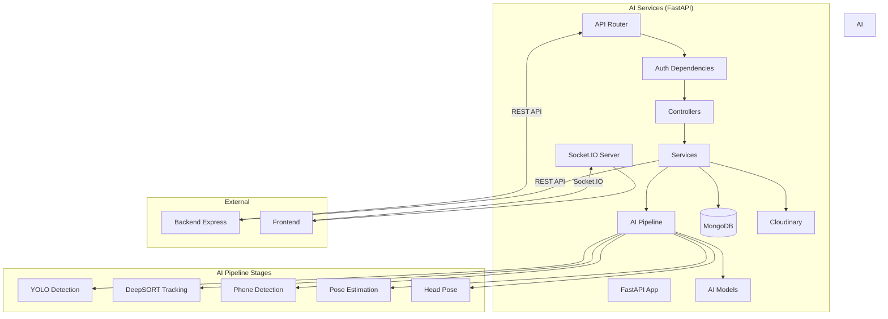

# AI Architecture

## Technology Stack

- **Framework:** FastAPI
- **Runtime:** Python 3.10+
- **Database:** MongoDB with Motor (async)
- **Real-Time:** Socket.IO
- **Cloud Storage:** Cloudinary
- **Validation:** Pydantic
- **AI Models:**
  - YOLOv8 (object detection)
  - DeepSORT (tracking)
  - YOLO Pose (pose estimation)
  - 6DRepNet (head pose)
  - InsightFace (face embeddings)

## Architecture Overview



## Layer Architecture

### Application Layer

**File:** `AI SERVICES/main.py`

**Purpose:** FastAPI application entry point

**Responsibilities:**
- FastAPI app creation
- Middleware setup (CORS)
- Exception handlers
- API router inclusion
- Socket.IO integration
- Lifespan events (startup/shutdown)

---

### API Layer

**Location:** `AI SERVICES/app/api/`

**Files:**
- `dependencies.py` - Auth dependencies
- `routes/health.py` - Health check
- `routes/student.py` - Student endpoints
- `routes/video.py` - Video processing endpoints

**Responsibilities:**
- Define API endpoints
- Apply authentication/authorization
- Request validation (Pydantic)
- Response formatting

---

### Service Layer

**Location:** `AI SERVICES/app/services/`

**Subdirectories:**
- `ai/` - AI pipeline services
- `backend/` - Backend integration services

**Responsibilities:**
- Business logic
- External service integration
- Data transformation
- Pipeline orchestration

---

### AI Pipeline Layer

**Location:** `AI SERVICES/app/services/ai/`

**Subdirectories:**
- `detectors/` - Object detection (YOLO, Phone)
- `trackers/` - Object tracking (DeepSORT)
- `analyzers/` - Behavior analysis (Pose, Head Pose, Phone)
- `pipeline/` - Pipeline framework
- `processors/` - Video processing
- `monitoring/` - Logging and events

**Responsibilities:**
- AI model execution
- Pipeline orchestration
- Real-time logging
- Event emission

---

### Model Layer

**Location:** `AI SERVICES/app/models/`

**Files:**
- `student.py` - Student Pydantic model

**Responsibilities:**
- Data schema definition
- Validation
- Serialization

---

### Repository Layer

**Location:** `AI SERVICES/app/repositories/`

**Files:**
- `base_repository.py` - Base repository
- `student_repository.py` - Student repository

**Responsibilities:**
- Database operations
- Query abstraction
- Data access

---

## Request Flow

### Typical Request Flow

```
Frontend/Backend Request
→ FastAPI App (main.py)
→ API Router
→ Auth Dependencies (JWT verification)
→ Controller/Route Handler
→ Service Layer
→ Repository/Model
→ MongoDB
→ Response
```

### Video Processing Flow

```
Frontend POST /api/v1/video/process
→ FastAPI App
→ Video Route
→ Auth Dependencies (verifyJWT)
→ Video Service
→ Video Processor
→ AI Pipeline (YOLO → DeepSORT → Phone → Pose → Head Pose)
→ Socket.IO Events (real-time progress)
→ Cloudinary Upload
→ Backend API (create video analysis)
→ Response
```

---

## AI Pipeline Architecture

### Pipeline Stages

1. **YOLO Detection** - Object detection (person, cell phone, etc.)
2. **DeepSORT Tracking** - Person tracking with stable IDs
3. **Phone Detection** - Phone detection with temporal tracking
4. **Pose Estimation** - YOLO Pose with 17 COCO keypoints
5. **Head Pose Estimation** - 6DRepNet for yaw, pitch, roll

### Pipeline Framework

**Base Class:** `PipelineStage`

**Purpose:** Abstract base for all pipeline stages

**Methods:**
- `process(context: FrameContext)` - Process frame

**Context:** `FrameContext` - Shared data object passed through stages

---

## Socket.IO Architecture

### Socket Manager

**File:** `AI SERVICES/app/services/ai/monitoring/socket_manager.py`

**Purpose:** Centralized Socket.IO management

**Implementation:** `socketio.AsyncServer` with ASGI integration

**Room-Based Communication:** Session-specific rooms for targeted updates

---

### Event Emitter

**File:** `AI SERVICES/app/services/ai/monitoring/event_emitter.py`

**Purpose:** Helper class for emitting standard pipeline events

**Events:**
- `pipeline_info` - General information
- `pipeline_error` - Errors
- `stage_started` - Stage started
- `stage_completed` - Stage completed
- `pipeline_started` - Pipeline started
- `pipeline_completed` - Pipeline completed
- `pipeline_failed` - Pipeline failed

---

## Database Architecture

### MongoDB Connection

**Driver:** Motor (async MongoDB driver)

**Connection String:** `mongodb://localhost:27017/neuroproctor`

**Database:** `neuroproctor`

**Collections:**
- students

### Data Access Pattern

**Pattern:** Repository pattern with async/await

**Example:**
```python
async def create_student(student_data: StudentCreate) -> StudentDocument:
    return await student_collection.insert_one(student_data.dict())
```

---

## Security Architecture

### Authentication

**Mechanism:** JWT verification

**Dependency:** `verify_jwt` in `api/dependencies.py`

**Process:**
1. Extract token from HttpOnly cookie
2. Verify signature using `ACCESS_TOKEN_SECRET`
3. Decode payload
4. Return `TokenPayload` object

### Authorization

**Mechanism:** Role-based access control

**Dependency:** `require_roles` factory function

**Roles:**
- `admin` - Full access
- `invigilator` - Student and video management

---

## Related Documentation

- [AI Services/AI Services Overview](AI%20Services/AI%20Services%20Overview.md) - AI Services overview
- [AI Services/Video Processing Pipeline](AI%20Services/Video%20Processing%20Pipeline.md) - Pipeline details
- [AI Services/AI Configuration](AI%20Services/AI%20Configuration.md) - Configuration
- [AI Services/AI Services File Reference](AI%20Services/AI%20Services%20File%20Reference.md) - File reference
