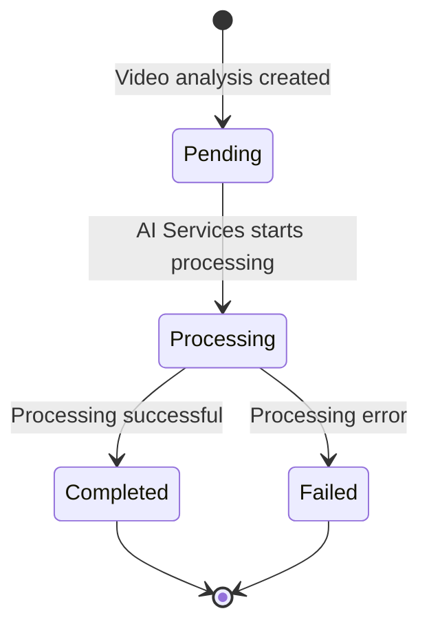

# Video and Cloudinary Flow

This document details video processing and Cloudinary integration in the Backend (Express) application.

## Cloudinary Integration

### Cloudinary Service

**File:** `Backend(Express)/src/Services/cloudinary.service.js`

**Purpose:** Handle Cloudinary operations

**Configuration:**
```javascript
cloudinary.config({
  cloud_name: process.env.CLOUDINARY_CLOUD_NAME,
  api_key: process.env.CLOUDINARY_API_KEY,
  api_secret: process.env.CLOUDINARY_API_SECRET,
});
```

### Image Upload

**Function:** `uploadImage(file)`

**Process:**
1. Receive file buffer
2. Upload to Cloudinary
3. Return public URL and public ID

**Usage:** Profile image upload during user registration

**Folder Structure:**
- Student images: `neuroproctor/students`

---

### Image Deletion

**Function:** `deleteImage(publicId)`

**Process:**
1. Receive Cloudinary public ID
2. Delete from Cloudinary
3. Return confirmation

**Usage:** Profile image deletion during user deletion

---

## Video Processing Flow

### Video Analysis Creation

**Route:** `POST /api/videoAnalysis`

**Controller:** `createVideoAnalysis` in `videoAnalysis.controller.js`

**Process:**
```
AI Services processes video
→ AI Services calls Backend POST /api/videoAnalysis
→ Backend validates request
→ Backend creates VideoAnalysis document
→ Backend saves to MongoDB
→ Backend returns confirmation
```

**Request Data:**
```json
{
  "sessionId": "session_id",
  "examId": "exam_id",
  "invigilatorId": "invigilator_id",
  "originalVideo": "cloudinary_url",
  "processedVideo": "cloudinary_url",
  "processingTime": 120.5
}
```

**Response:**
```json
{
  "success": true,
  "message": "Video analysis created successfully",
  "data": {
    "_id": "analysis_id",
    "sessionId": "session_id",
    "status": "completed"
  }
}
```

---

### Video Analysis Retrieval

**Route:** `GET /api/videoAnalysis/session/:sessionId`

**Controller:** `getVideoAnalysisBySession` in `videoAnalysis.controller.js`

**Process:**
```
Frontend requests video analysis
→ Backend verifies JWT
→ Backend queries MongoDB by sessionId
→ Backend returns VideoAnalysis document
```

**Response:**
```json
{
  "success": true,
  "data": {
    "_id": "analysis_id",
    "sessionId": "session_id",
    "originalVideo": "cloudinary_url",
    "processedVideo": "cloudinary_url",
    "status": "completed",
    "processingTime": 120.5
  }
}
```

---

## Cloudinary Folder Structure

### Folders Used

- `neuroproctor/students` - Student profile images
- `videos/original` - Original exam videos (managed by AI Services)
- `videos/processed` - Processed/annotated videos (managed by AI Services)

### Public ID Format

**Student Images:**
```
neuroproctor/students/{student_id}
```

**Videos:**
```
videos/original/session_{session_id}_original
videos/processed/session_{session_id}_processed
```

---

## Video Analysis Status Flow



### Status Descriptions

| Status | Description |
|--------|-------------|
| `pending` - Initial status, waiting for processing |
| `processing` - AI Services is processing video |
| `completed` - Processing completed successfully |
| `failed` - Processing failed with error |

---

## Related Documentation

- [Backend/Backend Architecture](Backend/Backend%20Architecture.md) - Backend architecture
- [Backend/Routes and Controllers](Backend/Routes%20and%20Controllers.md) - Routes and controllers
- [Backend/Services and Repositories](Backend/Services%20and%20Repositories.md) - Services
- [Workflows/Video Upload Workflow](Workflows/Video%20Upload%20Workflow.md) - Video upload workflow
