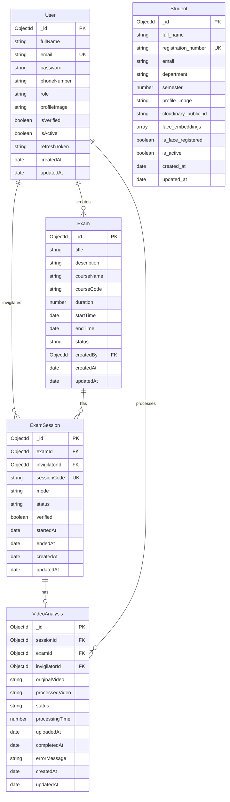

# Database Relationships Diagram

## Entity Relationship Diagram

## Relationship Descriptions

### User → Exam
- **Type:** One-to-Many
- **Description:** One user (admin/invigilator) can create many exams
- **Foreign Key:** `Exam.createdBy` → `User._id`

### User → ExamSession
- **Type:** One-to-Many
- **Description:** One user (invigilator) can be assigned to many exam sessions
- **Foreign Key:** `ExamSession.invigilatorId` → `User._id`

### Exam → ExamSession
- **Type:** One-to-Many
- **Description:** One exam can have many exam sessions
- **Foreign Key:** `ExamSession.examId` → `Exam._id`

### ExamSession → VideoAnalysis
- **Type:** One-to-One
- **Description:** One exam session has one video analysis record
- **Foreign Key:** `VideoAnalysis.sessionId` → `ExamSession._id`

### User → VideoAnalysis
- **Type:** One-to-Many
- **Description:** One user (invigilator) can process many video analyses
- **Foreign Key:** `VideoAnalysis.invigilatorId` → `User._id`

### Student
- **Type:** Independent
- **Description:** Student collection has no direct relationships to other collections
- **Usage:** Used for face enrollment and matching in AI pipeline

## Related Documentation

- [09 - Database Reference](09%20-%20Database%20Reference.md) - Detailed database schema
- [02 - System Architecture](02%20-%20System%20Architecture.md) - System design
