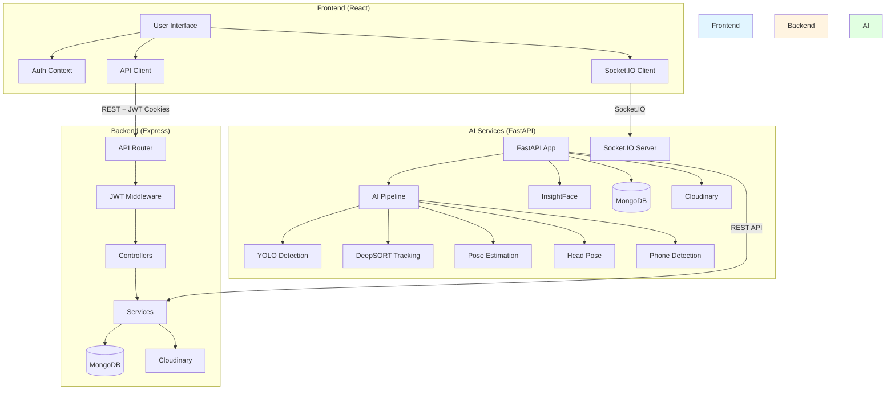

# High-Level Architecture Diagram

## System Architecture

## Component Descriptions

### Frontend (React)
- **User Interface:** React components for user interaction
- **Auth Context:** Manages authentication state
- **API Client:** Axios for HTTP requests
- **Socket.IO Client:** Real-time event handling

### Backend (Express)
- **API Router:** Route definitions
- **JWT Middleware:** Token verification
- **Controllers:** Request handlers
- **Services:** Business logic
- **MongoDB:** Data persistence
- **Cloudinary:** Image storage

### AI Services (FastAPI)
- **FastAPI App:** API server
- **Socket.IO Server:** Real-time events
- **AI Pipeline:** Video processing stages
- **YOLO Detection:** Object detection
- **DeepSORT Tracking:** Person tracking
- **Pose Estimation:** Body keypoints
- **Head Pose:** Head orientation
- **Phone Detection:** Phone detection
- **InsightFace:** Face recognition
- **MongoDB:** Student data
- **Cloudinary:** Video storage

## Related Documentation

- [02 - System Architecture](02%20-%20System%20Architecture.md) - Detailed architecture
- [Frontend/Frontend Overview](Frontend/Frontend%20Overview.md) - Frontend details
- [Backend/Backend Overview](Backend/Backend%20Overview.md) - Backend details
- [AI Services/AI Services Overview](AI%20Services/AI%20Services%20Overview.md) - AI Services details
