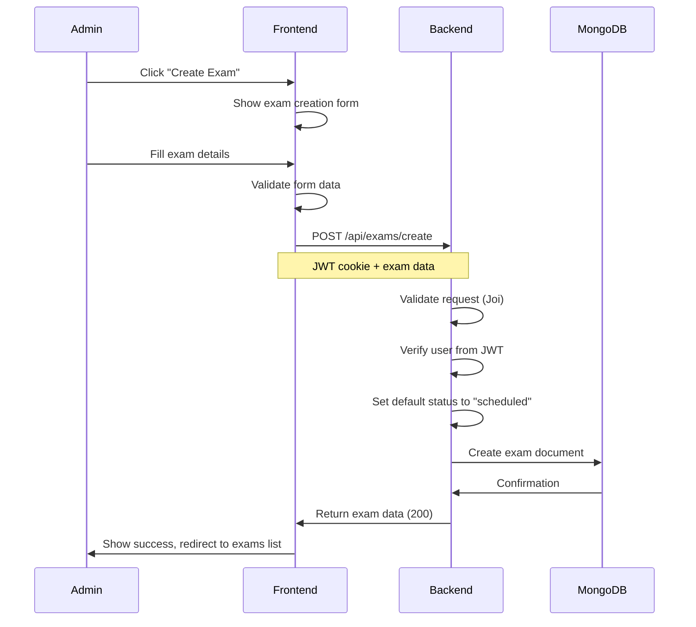
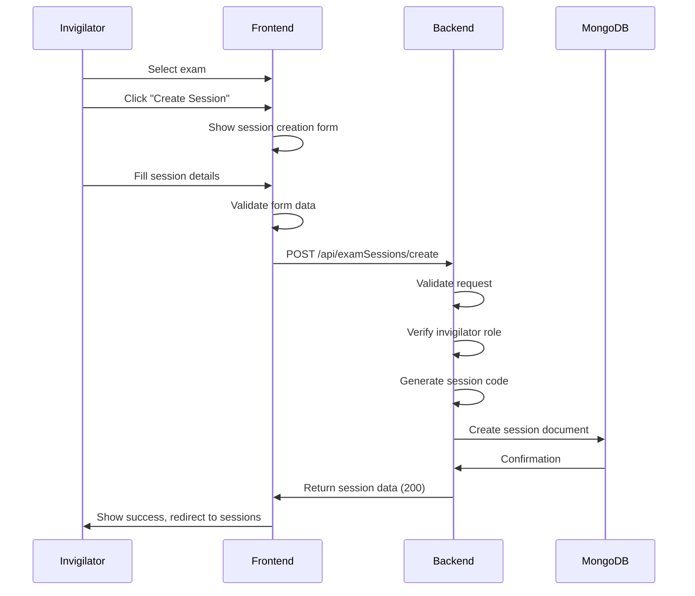
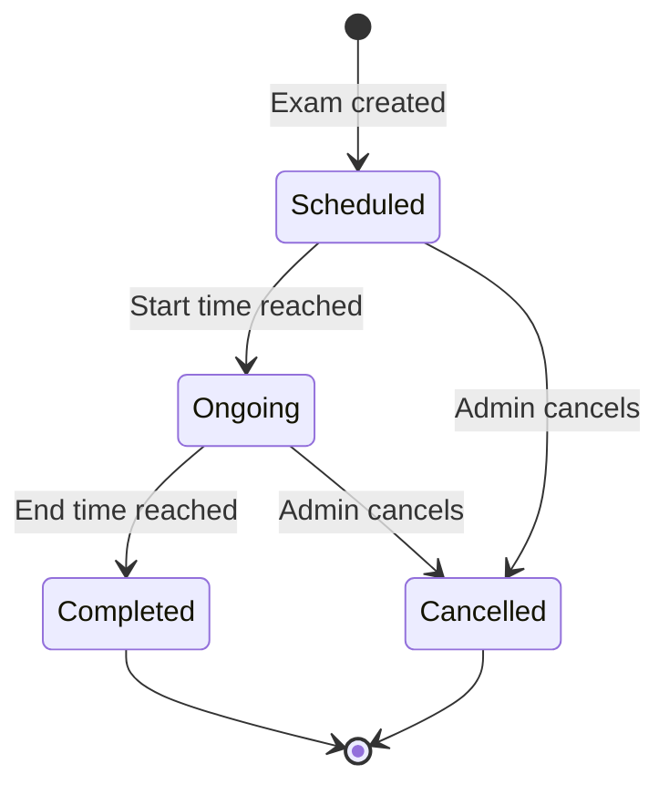
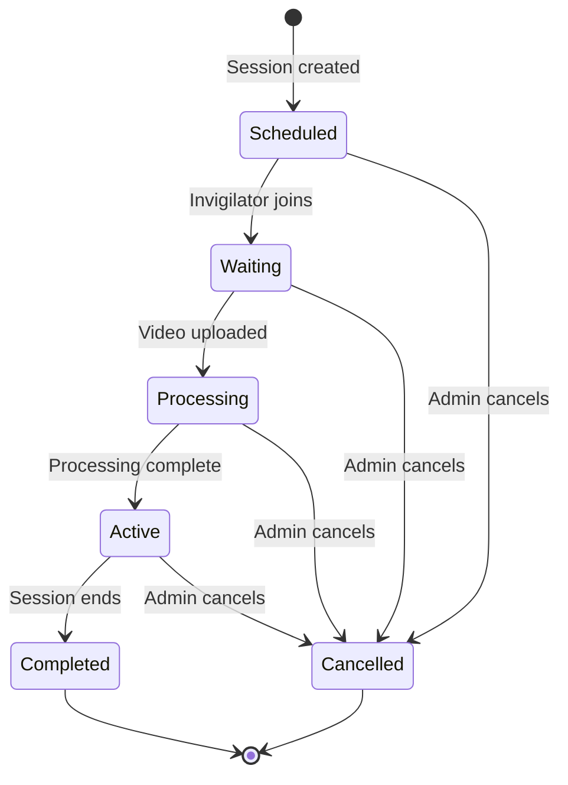

# Exam Creation Workflow

## Overview

This workflow describes the complete exam creation and management process.

## Exam Creation Flow

### Steps

1. **Admin clicks "Create Exam"**
   - Navigate to exam management section
   - Click create button

2. **Fill exam form**
   - Title
   - Description
   - Course name
   - Course code
   - Duration (in minutes)
   - Start time (ISO date)
   - End time (ISO date)

3. **Frontend validation**
   - Required fields check
   - Duration positive number
   - End time after start time
   - Date format validation

4. **Backend validation**
   - Joi schema validation
   - Verify user is admin
   - Verify end time > start time

5. **Exam creation**
   - Create exam document in MongoDB
   - Set status to "scheduled"
   - Set createdBy to user ID
   - Set timestamps

6. **Response**
   - Return exam data
   - Status: 200 OK

### Source Files

- Frontend: `Frontend/src/components/Exams/Exam.jsx`
- Frontend API: `Frontend/src/apis/Exams/index.js`
- Backend Route: `Backend(Express)/src/Routes/exam.route.js`
- Backend Controller: `Backend(Express)/src/Controllers/exam.controller.js`
- Backend Model: `Backend(Express)/src/Models/exam.models.js`

---

## Exam Session Creation Flow

### Steps

1. **Invigilator selects exam**
   - Browse exam list
   - Select exam for session

2. **Fill session form**
   - Exam ID (auto-filled)
   - Invigilator ID (auto-filled from JWT)
   - Session code (auto-generated or manual)
   - Mode (offline/live)

3. **Frontend validation**
   - Required fields check
   - Mode validation

4. **Backend validation**
   - Joi schema validation
   - Verify user is invigilator
   - Verify exam exists

5. **Session creation**
   - Create session document in MongoDB
   - Set status to "scheduled"
   - Set verified to false
   - Set timestamps

6. **Response**
   - Return session data
   - Status: 200 OK

### Source Files

- Frontend: `Frontend/src/components/ExamSessions/ExamSessionsList.jsx`
- Frontend API: `Frontend/src/apis/ExamSessions/index.js`
- Backend Route: `Backend(Express)/src/Routes/examSession.route.js`
- Backend Controller: `Backend(Express)/src/Controllers/examSession.controller.js`
- Backend Model: `Backend(Express)/src/Models/examSession.models.js`

---

## Exam Status Flow

### Status Descriptions

| Status | Description | Transitions |
|--------|-------------|-------------|
| `scheduled` | Exam is scheduled for future | → ongoing, → cancelled |
| `ongoing` | Exam is currently in progress | → completed, → cancelled |
| `completed` | Exam has finished | (final) |
| `cancelled` | Exam was cancelled | (final) |

---

## Session Status Flow

### Status Descriptions

| Status | Description | Transitions |
|--------|-------------|-------------|
| `scheduled` | Session is scheduled | → waiting, → cancelled |
| `waiting` | Invigilator has joined, waiting for video | → processing, → cancelled |
| `processing` | Video is being processed | → active, → cancelled |
| `active` | Session is active for monitoring | → completed, → cancelled |
| `completed` | Session has finished | (final) |
| `cancelled` | Session was cancelled | (final) |

---

## Error Handling

### Exam Creation Errors

| Error | Status | Description |
|-------|--------|-------------|
| Invalid input | 422 | Validation failed |
| Unauthorized | 401 | Invalid or missing JWT |
| Forbidden | 403 | User not admin |
| End time before start time | 422 | Time validation failed |

### Session Creation Errors

| Error | Status | Description |
|-------|--------|-------------|
| Invalid input | 422 | Validation failed |
| Unauthorized | 401 | Invalid or missing JWT |
| Forbidden | 403 | User not invigilator |
| Exam not found | 404 | Exam ID does not exist |
| Duplicate session code | 409 | Session code already exists |

---

## Related Documentation

- [04 - End-to-End Workflows](04%20-%20End-to-End%20Workflows.md) - Other workflows
- [08 - API Reference](08%20-%20API%20Reference.md) - API endpoints
- [09 - Database Reference](09%20-%20Database%20Reference.md) - Database models
