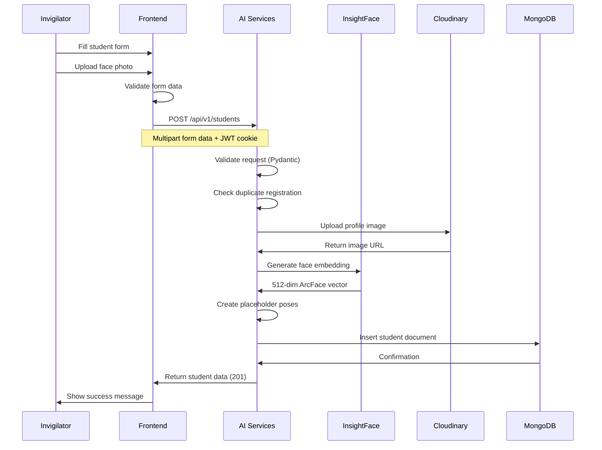
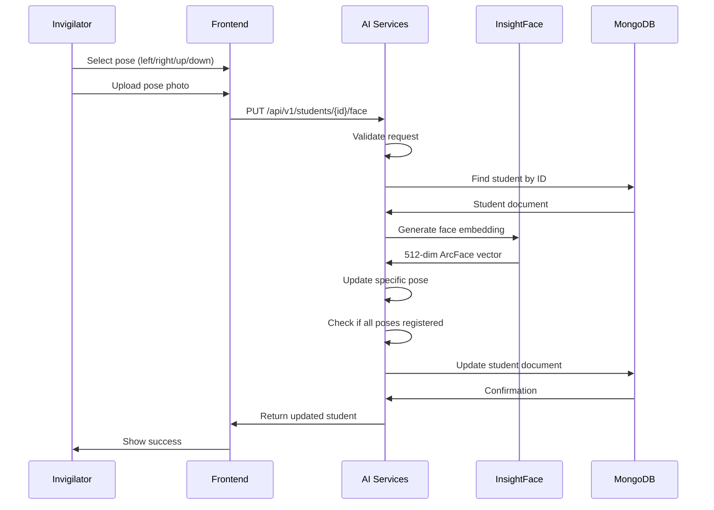

# Student Enrollment Workflow

## Overview

This workflow describes the complete student enrollment process, including registration and multi-pose face enrollment.

## Student Registration Flow



### Steps

1. **Invigilator fills student form**
   - Full name
   - Registration number
   - Email
   - Department
   - Semester (1-8)
   - Profile image (front-facing photo)

2. **Frontend validation**
   - Required fields check
   - Email format validation
   - Semester range validation (1-8)
   - Image file type validation (JPEG/PNG)
   - Image size validation (max 5MB)

3. **AI Services validation**
   - Pydantic schema validation
   - Check for duplicate registration number
   - Check for duplicate email

4. **Profile image upload**
   - Upload to Cloudinary folder: `neuroproctor/students`
   - Store URL in student document
   - Store public_id for deletion

5. **Face embedding generation**
   - Detect face using InsightFace
   - Generate 512-dimensional ArcFace embedding
   - Calculate quality score (detection confidence)

6. **Placeholder pose creation**
   - Create 5 pose entries: front, left, right, up, down
   - Front pose: actual embedding from uploaded photo
   - Other poses: empty embeddings (quality_score = 0.0)

7. **Student creation**
   - Insert student document in MongoDB
   - Set `is_face_registered: true` (front pose registered)
   - Set `is_active: true`

8. **Response**
   - Return complete student data
   - Status: 201 Created

### Source Files

- Frontend: `Frontend/src/components/Students/Student.jsx`
- Frontend API: `Frontend/src/apis/Students/index.js`
- AI Services Route: `AI SERVICES/app/api/routes/student.py`
- AI Services Service: `AI SERVICES/app/services/backend/student_service.py`
- AI Services Model: `AI SERVICES/app/models/student.py`

---

## Multi-Pose Face Enrollment Flow



### Steps

1. **Invigilator selects pose**
   - Choose from: left, right, up, down
   - Front pose is registered during initial registration

2. **Upload pose photo**
   - Upload photo for selected pose
   - Image validation (JPEG/PNG, max 5MB)

3. **AI Services validation**
   - Validate student ID exists
   - Validate pose is valid (front/left/right/up/down)
   - Validate image file

4. **Student lookup**
   - Find student by ID in MongoDB
   - Return 404 if not found

5. **Face embedding generation**
   - Detect face using InsightFace
   - Generate 512-dimensional ArcFace embedding
   - Calculate quality score

6. **Pose update**
   - Update specific pose entry in face_embeddings array
   - Replace empty embedding with actual embedding
   - Update quality_score and captured_at

7. **Registration check**
   - Check if all 5 poses now have embeddings
   - Update `is_face_registered` if all poses complete

8. **Student update**
   - Update student document in MongoDB
   - Update `updated_at` timestamp

9. **Response**
   - Return updated student data
   - Status: 200 OK

### Source Files

- Frontend: `Frontend/src/components/Students/StudentDetail.jsx`
- Frontend API: `Frontend/src/apis/Students/index.js`
- AI Services Route: `AI SERVICES/app/api/routes/student.py`
- AI Services Service: `AI SERVICES/app/services/backend/student_service.py`

---

## Valid Poses

The system supports 5 head poses for comprehensive face enrollment:

| Pose | Description | Purpose |
|------|-------------|---------|
| `front` | Front-facing | Primary face identification |
| `left` | Left profile | Side view identification |
| `right` | Right profile | Side view identification |
| `up` | Looking up | Head pose variation |
| `down` | Looking down | Head pose variation |

**Order:** Front pose is always registered first during initial enrollment. Other poses are added via separate requests.

---

## Face Embedding Structure

Each face embedding subdocument contains:

```json
{
  "pose": "front",
  "embedding": [0.1, 0.2, ..., 0.9],  // 512 float values
  "quality_score": 0.95,              // 0.0 to 1.0
  "captured_at": "2024-01-01T00:00:00Z"
}
```

**Placeholder (unregistered pose):**
```json
{
  "pose": "left",
  "embedding": [],                    // Empty array
  "quality_score": 0.0,               // Indicates not registered
  "captured_at": null                 // No capture timestamp
}
```

---

## Error Handling

### Registration Errors

| Error | Status | Description |
|-------|--------|-------------|
| Duplicate registration number | 409 | Registration number already exists |
| Duplicate email | 409 | Email already exists |
| Invalid input | 422 | Pydantic validation failed |
| Image upload failed | 500 | Cloudinary error |
| Face detection failed | 500 | InsightFace error |
| Database error | 500 | MongoDB error |

### Pose Update Errors

| Error | Status | Description |
|-------|--------|-------------|
| Student not found | 404 | Student ID does not exist |
| Invalid pose | 422 | Pose not in valid list |
| Invalid image | 422 | Image validation failed |
| Face detection failed | 500 | InsightFace error |
| Database error | 500 | MongoDB error |

---

## Quality Score

The quality score indicates the confidence of face detection:

- **0.0:** Placeholder (not registered)
- **0.0 - 0.5:** Low quality (may need re-capture)
- **0.5 - 0.8:** Medium quality
- **0.8 - 1.0:** High quality (excellent)

**Minimum recommended threshold:** 0.7

---

## Related Documentation

- [09 - Database Reference](09%20-%20Database%20Reference.md) - Student model details
- [08 - API Reference](08%20-%20API%20Reference.md) - Student API endpoints
- [AI Services/AI Services Overview](AI%20Services/AI%20Services%20Overview.md) - AI Services documentation
