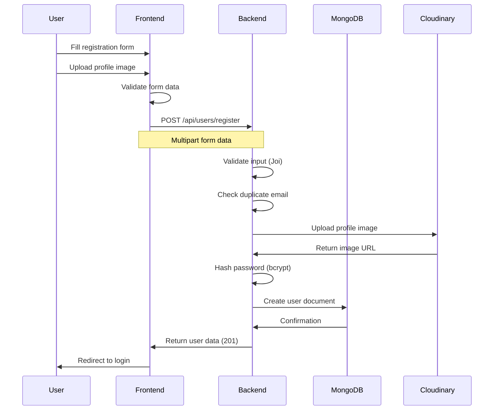
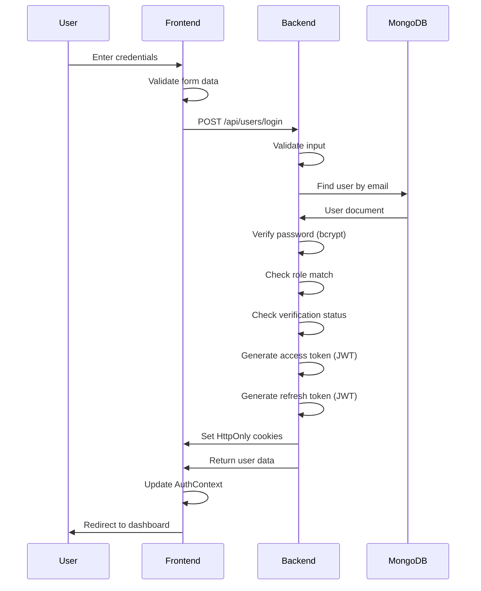
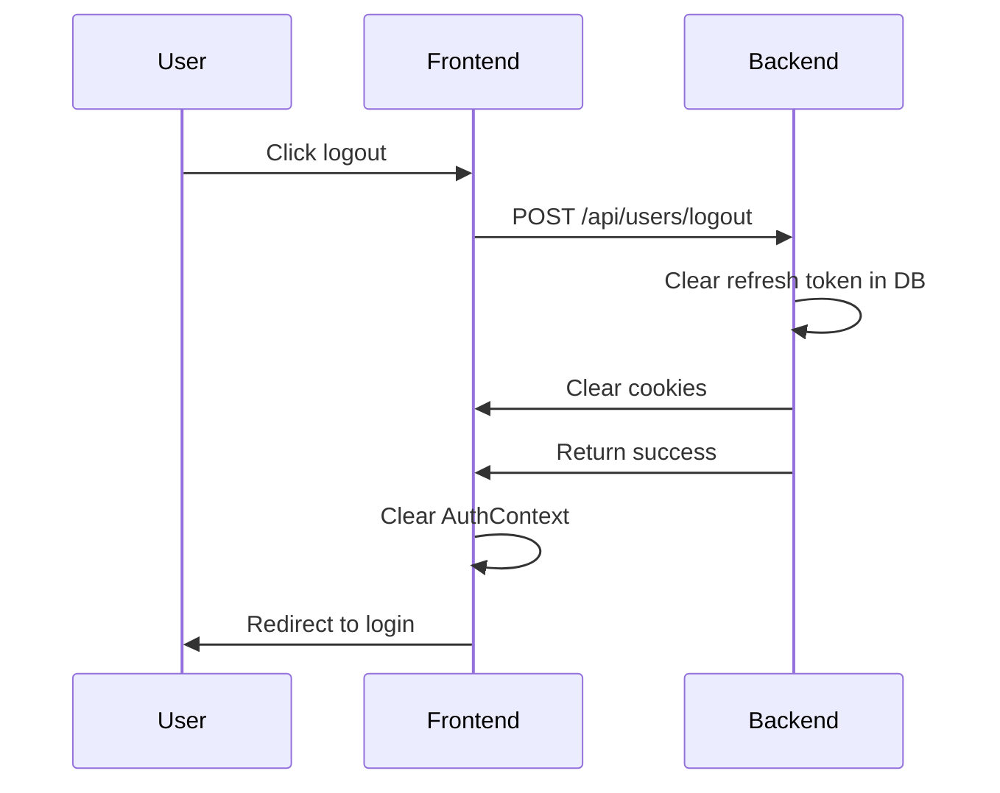
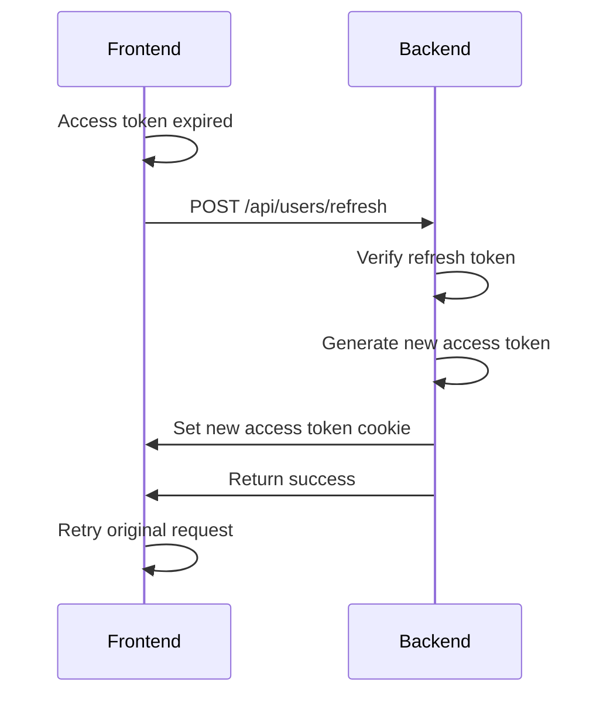

# User Authentication Workflow

## Overview

This workflow describes the complete user authentication process, including registration, login, logout, and token management.

## Registration Flow



### Steps

1. **User fills registration form**
   - Full name
   - Email
   - Password
   - Phone number
   - Role (invigilator/admin)
   - Profile image

2. **Frontend validation**
   - Required fields check
   - Email format validation
   - Password strength check (if implemented)

3. **Backend validation**
   - Joi schema validation
   - Check for duplicate email
   - Validate image file type and size

4. **Profile image upload**
   - Upload to Cloudinary
   - Store URL in user document

5. **Password hashing**
   - Hash using bcrypt (10 salt rounds)

6. **User creation**
   - Create user document in MongoDB
   - Set `isVerified: false`
   - Set `isActive: false`

7. **Response**
   - Return user data (excluding password)
   - Status: 201 Created

### Source Files

- Frontend: `Frontend/src/Pages/Auth/Register.jsx`
- Frontend API: `Frontend/src/apis/Users/index.js`
- Backend Route: `Backend(Express)/src/Routes/user.route.js`
- Backend Controller: `Backend(Express)/src/Controllers/user.controller.js`
- Backend Model: `Backend(Express)/src/Models/user.models.js`

---

## Login Flow



### Steps

1. **User enters credentials**
   - Email
   - Password
   - Role

2. **Frontend validation**
   - Required fields check
   - Email format validation

3. **Backend validation**
   - Joi schema validation

4. **User lookup**
   - Find user by email in MongoDB
   - Return 404 if not found

5. **Password verification**
   - Compare password with hash using bcrypt
   - Return 401 if mismatch

6. **Role verification**
   - Check if role matches selected role
   - Return 403 if mismatch

7. **Verification check**
   - Check if user is verified
   - Return 403 if not verified (for invigilators)

8. **Token generation**
   - Generate access token (15 min expiry)
   - Generate refresh token (7 day expiry)
   - Payload includes: _id, email, fullName, role

9. **Cookie setting**
   - Set `accessToken` cookie (HttpOnly)
   - Set `refreshToken` cookie (HttpOnly)
   - Cookie options: httpOnly, sameSite, maxAge

10. **Response**
    - Return user data
    - Status: 200 OK

### Source Files

- Frontend: `Frontend/src/Pages/Auth/Login.jsx`
- Frontend API: `Frontend/src/apis/Users/index.js`
- Backend Route: `Backend(Express)/src/Routes/user.route.js`
- Backend Controller: `Backend(Express)/src/Controllers/user.controller.js`
- Backend Utils: `Backend(Express)/src/Utils/index.utils.js`

---

## Logout Flow



### Steps

1. **User clicks logout**
   - Trigger logout action

2. **Backend request**
   - POST to `/api/users/logout`
   - JWT verified via middleware

3. **Token cleanup**
   - Clear refresh token in user document
   - (Optional: Invalidate access token)

4. **Cookie clearing**
   - Clear `accessToken` cookie
   - Clear `refreshToken` cookie

5. **Frontend cleanup**
   - Clear user from AuthContext
   - Clear any cached data

6. **Redirect**
   - Redirect to login page

### Source Files

- Frontend: `Frontend/src/contexts/AuthContext.jsx`
- Frontend API: `Frontend/src/apis/Users/index.js`
- Backend Route: `Backend(Express)/src/Routes/user.route.js`
- Backend Controller: `Backend(Express)/src/Controllers/user.controller.js`

---

## Token Refresh Flow

**Status:** Not Implemented

**Description:** Currently, refresh tokens are stored but not used for automatic token renewal. Users must re-login after access token expires (15 minutes).

**Recommended Implementation:**



---

## Error Handling

### Registration Errors

| Error | Status | Description |
|-------|--------|-------------|
| Duplicate email | 409 | Email already registered |
| Invalid input | 422 | Validation failed |
| Image upload failed | 500 | Cloudinary error |
| Database error | 500 | MongoDB error |

### Login Errors

| Error | Status | Description |
|-------|--------|-------------|
| User not found | 404 | Email not registered |
| Invalid password | 401 | Password mismatch |
| Role mismatch | 403 | Selected role doesn't match user role |
| Not verified | 403 | User not verified by admin |

### Logout Errors

| Error | Status | Description |
|-------|--------|-------------|
| Unauthorized | 401 | Invalid or missing token |

---

## Security Considerations

### Password Security
- Hashed using bcrypt with 10 salt rounds
- Never stored in plain text
- Never returned in API responses

### Token Security
- HttpOnly cookies prevent XSS attacks
- SameSite attribute prevents CSRF attacks
- Short access token expiry (15 minutes)
- Refresh token for long-term sessions

### Cookie Configuration
```javascript
{
  httpOnly: true,      // Prevents JavaScript access
  secure: false,       // Set to true in production with HTTPS
  sameSite: 'lax',     // CSRF protection
  maxAge: 7 days       // Matches refresh token expiry
}
```

---

## Related Documentation

- [11 - Security and Authentication](11%20-%20Security%20and%20Authentication.md) - Security details
- [08 - API Reference](08%20-%20API%20Reference.md) - API endpoints
- [04 - End-to-End Workflows](04%20-%20End-to-End%20Workflows.md) - Other workflows
