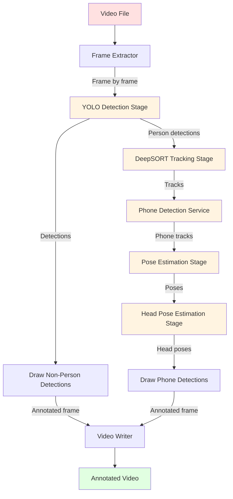

# Video Processing Workflow

## Overview

This workflow describes the internal AI pipeline processing workflow for video analysis.

## Pipeline Flow



## Stage 1: Frame Extraction

**Component:** `FrameExtractor`

**File:** `AI SERVICES/app/services/ai/processors/frame_extractor.py`

**Purpose:** Extract frames from video file

**Process:**
1. Open video file using OpenCV
2. Get total frame count
3. Iterate through frames one by one
4. Yield frame number and frame data
5. Close video file on completion

**Output:** Iterator of (frame_number, frame) tuples

---

## Stage 2: YOLO Detection

**Component:** `YOLODetectionStage`

**File:** `AI SERVICES/app/services/ai/detectors/yolo/stage.py`

**Purpose:** Detect objects in each frame

**Process:**
1. Load YOLO model (yolov8m.pt)
2. Run inference on frame
3. Apply confidence threshold (0.25)
4. Apply IOU threshold for NMS (0.45)
5. Return detections with bounding boxes

**Detected Classes:**
- person
- cell phone
- laptop
- book
- bottle
- (other COCO classes)

**Output:** List of Detection objects

**Detection Structure:**
```python
class Detection:
    bbox: [x1, y1, x2, y2]
    confidence: float
    class_name: str
    class_id: int
```

---

## Stage 3: Non-Person Annotation

**Component:** `_draw_non_person_detections`

**File:** `AI SERVICES/app/services/ai/processors/video_processor.py`

**Purpose:** Draw bounding boxes for non-person detections before DeepSORT

**Process:**
1. Iterate through detections
2. Skip person detections (handled by DeepSORT)
3. Draw bounding box with class-specific color
4. Draw label with confidence score

**Output:** Annotated frame with non-person boxes

---

## Stage 4: DeepSORT Tracking

**Component:** `DeepSORTStage`

**File:** `AI SERVICES/app/services/ai/trackers/deepsort/stage.py`

**Purpose:** Track persons across frames

**Process:**
1. Extract person detections from YOLO results
2. Convert detections to DeepSORT format
3. Update tracker with new detections
4. Match detections to existing tracks
5. Create new tracks for unmatched detections
6. Delete tracks that haven't been seen
7. Confirm tracks after minimum hits (MIN_HITS_TO_CONFIRM)

**Output:** List of Track objects

**Track Structure:**
```python
class Track:
    track_id: int
    bbox: [x1, y1, x2, y2]
    state: TrackState (tentative/confirmed/deleted)
    hits: int
    age: int
    time_since_update: int
```

**Track States:**
- `tentative` - New track, not yet confirmed
- `confirmed` - Track has enough hits to be confirmed
- `deleted` - Track has been deleted

---

## Stage 5: Phone Detection

**Component:** `PhoneDetectionService`

**File:** `AI SERVICES/app/services/ai/detectors/phone/service.py`

**Purpose:** Detect phones with temporal tracking and student association

**Process:**

### Full-Frame Detection
1. Run YOLO detection for "cell phone" class
2. Apply phone-specific confidence threshold (0.10)
3. Use larger image size (960) for better detection

### ROI Detection
1. For each confirmed person track
2. Expand bounding box by ROI expansion factor (0.15)
3. Run YOLO detection within ROI
4. Apply lower confidence threshold for ROI

### Detection Merging
1. Merge full-frame and ROI detections
2. Deduplicate using IOU threshold (0.50)

### Temporal Tracking
1. Match detections to existing phone tracks
2. Create new tracks for unmatched detections
3. Confirm tracks after N frames (3)
4. Delete tracks after N missed frames (2)

### Phone Association
1. For each phone track
2. Calculate association scores with person tracks
3. Use wrist-based priority scoring
4. Associate with best matching person

**Output:** List of PhoneTrack objects

**PhoneTrack Structure:**
```python
class PhoneTrack:
    phone_track_id: int
    bounding_box: [x1, y1, x2, y2]
    confidence: float
    state: PhoneState (candidate/confirmed/lost)
    student_track_id: int or None
    association_method: str
```

---

## Stage 6: Pose Estimation

**Component:** `YoloPoseStage`

**File:** `AI SERVICES/app/services/ai/analyzers/pose/stage.py`

**Purpose:** Estimate pose keypoints for each person

**Process:**
1. Load YOLO Pose model (yolov8m-pose.pt)
2. For each person track
3. Crop person from frame using bounding box
4. Run pose estimation on crop
5. Extract 17 COCO keypoints
6. Filter by confidence and visibility
7. Associate pose with track ID

**COCO Keypoints:**
- 0: nose
- 1: left_eye
- 2: right_eye
- 3: left_ear
- 4: right_ear
- 5: left_shoulder
- 6: right_shoulder
- 7: left_elbow
- 8: right_elbow
- 9: left_wrist
- 10: right_wrist
- 11: left_hip
- 12: right_hip
- 13: left_knee
- 14: right_knee
- 15: left_ankle
- 16: right_ankle

**Output:** List of PoseResult objects

**PoseResult Structure:**
```python
class PoseResult:
    track_id: int
    keypoints: [(x, y, confidence, visibility), ...]  # 17 keypoints
    bbox: [x1, y1, x2, y2]
    confidence: float
```

---

## Stage 7: Head Pose Estimation

**Component:** `SixDRepNetHeadPoseStage`

**File:** `AI SERVICES/app/services/ai/analyzers/head_pose/stage.py`

**Purpose:** Estimate head orientation (yaw, pitch, roll)

**Process:**

### Face Localization
1. For each person track
2. Locate face using pose keypoints (nose, eyes)
3. Calculate face bounding box
4. Validate face size (minimum 40 pixels)

### Face Cropping
1. Crop face from frame
2. Apply padding (20%)
3. Resize to input size (224x224)

### Head Pose Estimation
1. Load 6DRepNet model
2. Run inference on face crop
3. Get yaw, pitch, roll angles (in degrees)

### Temporal Smoothing
1. Apply exponential moving average (EMA)
2. Smoothing alpha: 0.35
3. Protect against large single-frame changes (max 45 degrees)
4. Clear state after N missing frames (5)

### Quality Evaluation
1. Evaluate keypoint quality
2. Evaluate face detection confidence
3. Filter low-quality results

**Output:** List of HeadPoseResult objects

**HeadPoseResult Structure:**
```python
class HeadPoseResult:
    track_id: int
    yaw: float  # degrees
    pitch: float  # degrees
    roll: float  # degrees
    confidence: float
    quality_score: float
```

---

## Stage 8: Phone Annotation

**Component:** `_draw_phone_detections`

**File:** `AI SERVICES/app/services/ai/processors/video_processor.py`

**Purpose:** Draw phone detections with student association

**Process:**
1. For each phone track
2. Get bounding box coordinates
3. Determine color based on state:
   - Candidate: Orange
   - Confirmed: Yellow
   - Other: Gray
4. Draw bounding box
5. Draw label with:
   - State
   - Confidence
   - Student association (Student {track_id} or Unknown)
6. (Optional) Draw debug line to person center

**Output:** Annotated frame with phone boxes

---

## Stage 9: Video Writing

**Component:** OpenCV VideoWriter

**File:** `AI SERVICES/app/services/ai/processors/video_processor.py`

**Purpose:** Write annotated frames to output video

**Process:**
1. Get video properties (FPS, width, height)
2. Create VideoWriter with MP4 codec
3. Write each annotated frame
4. Release writer on completion

**Output:** Annotated video file

---

## FrameContext

**Component:** `FrameContext`

**File:** `AI SERVICES/app/services/ai/pipeline/frame_context.py`

**Purpose:** Shared data object passed through pipeline stages

**Structure:**
```python
class FrameContext:
    frame: numpy.ndarray
    frame_number: int
    timestamp: datetime
    detections: List[Detection]
    tracks: List[Track]
    poses: List[PoseResult]
    head_poses: List[HeadPoseResult]
    phone_tracks: List[PhoneTrack]
```

---

## Configuration

### YOLO Settings

**File:** `AI SERVICES/app/config/settings.py`

```python
YOLO_MODEL = "yolov8m.pt"
YOLO_DEVICE = "auto"
YOLO_CONFIDENCE = 0.25
YOLO_IOU = 0.45
YOLO_IMAGE_SIZE = 640
```

### DeepSORT Settings

**File:** `AI SERVICES/app/services/ai/trackers/deepsort/constants.py`

```python
MIN_HITS_TO_CONFIRM = 3
MAX_AGE = 30
IOU_THRESHOLD = 0.3
```

### Phone Detection Settings

**File:** `AI SERVICES/app/config/settings.py`

```python
PHONE_CONFIDENCE = 0.10
PHONE_IMAGE_SIZE = 960
PHONE_TEMPORAL_CONFIRM_FRAMES = 3
PHONE_TEMPORAL_MAX_MISSED_FRAMES = 2
PHONE_ASSOCIATION_IOU = 0.10
PHONE_ROI_ENABLED = True
PHONE_ROI_EXPANSION = 0.15
```

### Head Pose Settings

**File:** `AI SERVICES/app/config/settings.py`

```python
HEAD_POSE_INPUT_SIZE = 224
HEAD_POSE_FACE_PADDING = 0.20
HEAD_POSE_MIN_FACE_SIZE = 40
HEAD_POSE_SMOOTHING_ENABLED = True
HEAD_POSE_SMOOTHING_ALPHA = 0.35
HEAD_POSE_MAX_SINGLE_FRAME_DELTA = 45.0
```

---

## Source Files

- Video Processor: `AI SERVICES/app/services/ai/processors/video_processor.py`
- Frame Extractor: `AI SERVICES/app/services/ai/processors/frame_extractor.py`
- YOLO Stage: `AI SERVICES/app/services/ai/detectors/yolo/stage.py`
- DeepSORT Stage: `AI SERVICES/app/services/ai/trackers/deepsort/stage.py`
- Pose Stage: `AI SERVICES/app/services/ai/analyzers/pose/stage.py`
- Head Pose Stage: `AI SERVICES/app/services/ai/analyzers/head_pose/stage.py`
- Phone Service: `AI SERVICES/app/services/ai/detectors/phone/service.py`
- Phone Associator: `AI SERVICES/app/services/ai/analyzers/phone/associator.py`
- Frame Context: `AI SERVICES/app/services/ai/pipeline/frame_context.py`

---

## Related Documentation

- [04 - End-to-End Workflows](04%20-%20End-to-End%20Workflows.md) - Other workflows
- [AI Services/AI Services Overview](AI%20Services/AI%20Services%20Overview.md) - AI Services documentation
- [Workflows/Video Upload Workflow](Workflows/Video%20Upload%20Workflow.md) - Upload workflow
