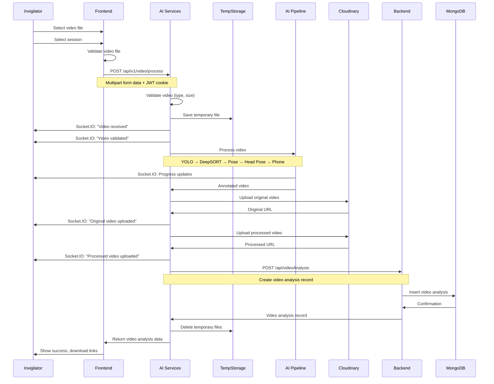

# Video Upload Workflow

## Overview

This workflow describes the complete video upload and processing workflow, including validation, AI pipeline processing, Cloudinary upload, and record creation.

## Video Upload Flow



## Detailed Steps

### 1. Video Selection

**User Action:**
- Select video file from local system
- Select exam session from dropdown
- Click "Upload Video" button

**Frontend Validation:**
- File type: MP4, AVI, MOV
- File size: Maximum 500MB
- Session must be selected

---

### 2. Video Upload to AI Services

**Request:** `POST /api/v1/video/process`

**Request Data:**
- `video`: Video file (multipart/form-data)
- `sessionId`: Exam session ID
- `examId`: Exam ID

**Authentication:** JWT via HttpOnly cookie (invigilator role required)

---

### 3. Video Validation

**AI Services Validation:**

**File Type Check:**
```python
allowed_types = [
    "video/mp4",
    "video/avi",
    "video/quicktime",
    "video/x-msvideo",
]
```

**File Size Check:**
- Maximum: 500 MB
- Returns error if exceeded

---

### 4. Temporary File Storage

**Process:**
- Generate unique filename using UUID
- Save to `temp/` directory
- Store file path for processing

---

### 5. Socket.IO Events - Initial

**Events Emitted:**
- `pipeline_info` - "Video received"
- `pipeline_info` - "Video validated successfully"
- `pipeline_info` - "Temporary file created"

---

### 6. AI Pipeline Processing

**Pipeline Stages:**

1. **YOLO Detection**
   - Detect objects (person, cell phone, laptop, book, bottle)
   - Return bounding boxes and confidence scores

2. **DeepSORT Tracking**
   - Track persons across frames
   - Assign stable track IDs
   - Handle track creation, confirmation, and deletion

3. **Phone Detection**
   - Detect cell phones (full-frame + ROI)
   - Temporal tracking for confirmation
   - Phone-to-student association with wrist-based priority

4. **Pose Estimation**
   - Estimate 17 COCO keypoints per person
   - Associate poses with DeepSORT tracks
   - Filter by confidence and visibility

5. **Head Pose Estimation**
   - Estimate yaw, pitch, roll angles
   - Use face crops from pose keypoints
   - Temporal smoothing for stability
   - Quality evaluation for filtering

**Socket.IO Events During Processing:**
- `pipeline_started` - "Pipeline started"
- `stage_started` - "Stage started: YOLO Detection"
- `stage_completed` - "Stage completed: YOLO Detection"
- `pipeline_info` - Progress updates per frame
- `stage_started` - "Stage started: DeepSORT Tracking"
- `stage_completed` - "Stage completed: DeepSORT Tracking"
- ... (repeat for each stage)
- `pipeline_completed` - "Pipeline completed"

---

### 7. Video Annotation

**Process:**
- Draw bounding boxes for detected objects
- Draw track IDs for persons
- Draw phone detections with student association
- Draw head pose orientation axes (if enabled)
- Write annotated video to `annotated_videos/` directory

---

### 8. Cloudinary Upload - Original Video

**Process:**
- Upload original video from temp storage
- Folder: `videos/original`
- Public ID: `session_{sessionId}_original`
- Store returned URL

**Socket.IO Event:**
- `pipeline_info` - "Original video uploaded"

---

### 9. Cloudinary Upload - Processed Video

**Process:**
- Upload processed/annotated video
- Folder: `videos/processed`
- Public ID: `session_{sessionId}_processed`
- Store returned URL

**Socket.IO Event:**
- `pipeline_info` - "Processed video uploaded"

---

### 10. Video Analysis Record Creation

**Request to Backend:** `POST /api/videoAnalysis`

**Request Data:**
```json
{
  "sessionId": "session_id",
  "examId": "exam_id",
  "invigilatorId": "invigilator_id",
  "originalVideo": "cloudinary_url_original",
  "processedVideo": "cloudinary_url_processed",
  "processingTime": 120.5
}
```

**Authentication:** JWT access token

**Backend Process:**
- Create video analysis document in MongoDB
- Set status to "completed"
- Record timestamps

---

### 11. Temporary File Cleanup

**Process:**
- Delete original video from temp storage
- Delete processed video from annotated_videos
- Clean up any intermediate files

---

### 12. Response

**Response Data:**
```json
{
  "success": true,
  "message": "Video processed successfully",
  "data": {
    "videoAnalysis": {
      "_id": "video_analysis_id",
      "sessionId": "session_id",
      "examId": "exam_id",
      "invigilatorId": "invigilator_id",
      "originalVideo": "cloudinary_url",
      "processedVideo": "cloudinary_url",
      "status": "completed",
      "processingTime": 120.5,
      "uploadedAt": "timestamp",
      "completedAt": "timestamp"
    },
    "processingTime": 120.5
  }
}
```

---

## Socket.IO Progress Updates

### Frame Progress Event

**Event:** `pipeline_info`

**Data Structure:**
```json
{
  "message": "Processing frame 100/1000 (10%)",
  "data": {
    "frame_number": 100,
    "total_frames": 1000,
    "progress": 10,
    "stage": "video_processing"
  }
}
```

### Stage Events

**Event:** `stage_started` / `stage_completed`

**Data Structure:**
```json
{
  "message": "Stage started: YOLO Detection",
  "data": {
    "stage": "YOLO Detection"
  }
}
```

---

## Error Handling

### Upload Errors

| Error | Status | Description |
|-------|--------|-------------|
| Invalid video format | 400 | File type not supported |
| Video too large validation | 400 | File exceeds 500MB |
| Unauthorized | 401 | Invalid or missing JWT |
| Forbidden | 403 | User not invigilator |
| Session not found | 404 | Session ID does not exist |

### Processing Errors

| Error | Status | Description |
|-------|--------|-------------|
| Pipeline failed | 500 | AI pipeline error |
| Cloudinary upload failed | 500 | Cloudinary error |
| Backend API error | 500 | Express backend error |
| Database error | 500 | MongoDB error |

**Socket.IO Error Event:**
- `pipeline_error` - Emitted with error details

---

## Configuration

### Video Validation Settings

**File:** `AI SERVICES/app/services/backend/video_service.py`

```python
allowed_types = [
    "video/mp4",
    "video/avi",
    "video/quicktime",
    "video/x-msvideo",
]
max_bytes = 500 * 1_024 * 1_024  # 500 MB
```

### AI Pipeline Settings

**File:** `AI SERVICES/app/config/settings.py`

- YOLO confidence threshold: 0.25
- Phone confidence threshold: 0.10
- Phone temporal confirm frames: 3
- Head pose smoothing enabled: true

---

## Source Files

- Frontend: `Frontend/src/components/VideoUpload/VideoUpload.jsx`
- Frontend API: `Frontend/src/apis/VideoAnalysis/index.js`
- AI Services Route: `AI SERVICES/app/api/routes/video.py`
- AI Services Service: `AI SERVICES/app/services/backend/video_service.py`
- AI Services Processor: `AI SERVICES/app/services/ai/processors/video_processor.py`
- Backend Route: `Backend(Express)/src/Routes/videoAnalysis.route.js`
- Backend Controller: `Backend(Express)/src/Controllers/videoAnalysis.controller.js`

---

## Related Documentation

- [04 - End-to-End Workflows](04%20-%20End-to-End%20Workflows.md) - Other workflows
- [10 - Socket.IO Events](10%20-%20Socket.IO%20Events.md) - Real-time events
- [AI Services/Video Processing Pipeline](AI%20Services/Video%20Processing%20Pipeline.md) - AI pipeline details
- [08 - API Reference](08%20-%20API%20Reference.md) - API endpoints
